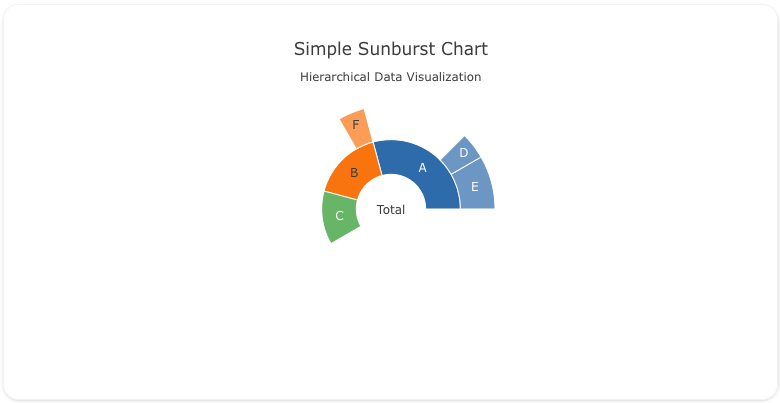
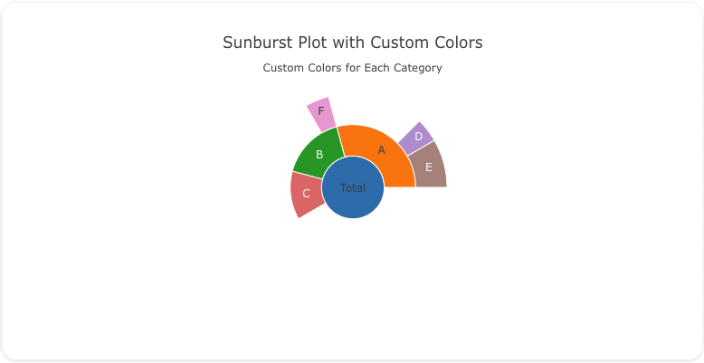
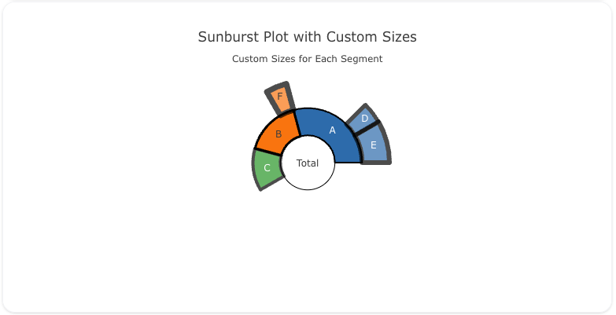

---
search:
  exclude: true
---
<!--start-->
## Overview

The `sunburst` trace type is used to create sunburst charts, which visualize hierarchical data in a circular format. Sunburst charts are useful for showing relationships between parts and the whole, with nested levels of data radiating outward from the center.

You can customize the colors, labels, and hierarchy of the chart to represent your data effectively.

!!! tip "Common Uses"
    - **Hierarchical Data Visualization**: Displaying relationships between different levels of data.
    - **Part-to-Whole Relationships**: Visualizing how parts contribute to the whole across multiple levels.
    - **Categorical Data**: Showing categorical breakdowns with nested data.

_**Check out the [Attributes](../configuration/Trace/Props/Sunburst/#attributes) for the full set of configuration options**_

## Examples


!!! example "Common Configurations"

    === "Simple Sunburst Plot"

        Here's a simple `sunburst` plot showing a hierarchy of categories:

        

        You can copy this code below to create this chart in your project:

        ```yaml
        models:
          - name: sunburst-data
            args:
              - echo
              - |
                labels,parents,values
                Total,,100
                A,Total,40
                B,Total,30
                C,Total,30
                D,A,10
                E,A,20
                F,B,10
        traces:
          - name: Simple Sunburst Plot
            model: ref(sunburst-data)
            props:
              type: sunburst
              labels: ?{labels}
              parents: ?{parents}
              values: ?{"values"}
        charts:
          - name: Simple Sunburst Chart
            traces:
              - ref(Simple Sunburst Plot)
            layout:
              title:
                text: Simple Sunburst Chart<br><sub>Hierarchical Data Visualization</sub>
        ```

    === "Sunburst Plot with Custom Colors"

        This example demonstrates a `sunburst` plot where each category has custom colors:

        

        Here's the code:

        ```yaml
        models:
          - name: sunburst-data-colors
            args:
              - echo
              - |
                labels,parents,values,colors
                Total,,100,#1f77b4
                A,Total,40,#ff7f0e
                B,Total,30,#2ca02c
                C,Total,30,#d62728
                D,A,10,#9467bd
                E,A,20,#8c564b
                F,B,10,#e377c2
        traces:
          - name: Sunburst Plot with Custom Colors
            model: ref(sunburst-data-colors)
            props:
              type: sunburst
              labels: ?{labels}
              parents: ?{parents}
              values: ?{"values"}
              marker:
                colors: ?{colors}
        charts:
          - name: Sunburst Chart with Custom Colors
            traces:
              - ref(Sunburst Plot with Custom Colors)
            layout:
              title:
                text: Sunburst Plot with Custom Colors<br><sub>Custom Colors for Each Category</sub>
        ```

    === "Sunburst Plot with Custom Sizes"

        Here's a `sunburst` plot where the size of each segment is customized based on additional values:

        

        Here's the code:

        ```yaml
        models:
          - name: sunburst-data-sizes
            args:
              - echo
              - |
                labels,parents,values,size
                Total,,100,1
                A,Total,40,2
                B,Total,30,3
                C,Total,30,4
                D,A,10,5
                E,A,20,6
                F,B,10,7
        traces:
          - name: Sunburst Plot with Custom Sizes
            model: ref(sunburst-data-sizes)
            props:
              type: sunburst
              labels: ?{labels}
              parents: ?{parents}
              values: ?{"values"}
              marker:
                line:
                  width: ?{size}
                  color: black
        charts:
          - name: Sunburst Chart with Custom Sizes
            traces:
              - ref(Sunburst Plot with Custom Sizes)
            layout:
              title:
                text: Sunburst Plot with Custom Sizes<br><sub>Custom Sizes for Each Segment</sub>
        ```


<!--end-->