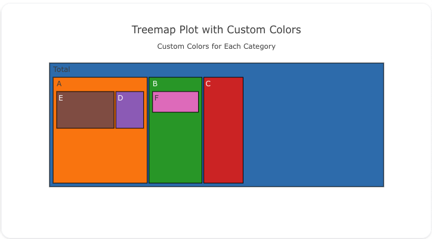
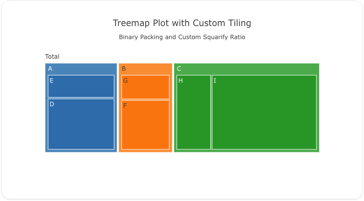

---
search:
  exclude: true
---
<!--start-->
## Overview

The `treemap` trace type is used to create treemap charts, which visualize hierarchical data through nested rectangles. Each branch of the hierarchy is represented as a rectangle, with smaller rectangles inside representing sub-branches. Treemaps are useful for visualizing part-to-whole relationships and comparing the size of different categories.

You can customize the colors, labels, and hierarchy to represent your data effectively.

!!! tip "Common Uses"
    - **Hierarchical Data Visualization**: Displaying nested data as a set of rectangles.
    - **Part-to-Whole Relationships**: Visualizing how different categories contribute to the whole.
    - **Categorical Data**: Showing categorical breakdowns with nested structures.

_**Check out the [Attributes](../configuration/Trace/Props/Treemap/#attributes) for the full set of configuration options**_

!!! warning "Unexpected Behavior"

    The terminal values of a `treemap` must be unique. In other words- if you create a treemap with multiple parent-child trees, the values must be unique across all squares that have no children.

## Examples


!!! example "Common Configurations"

    === "Simple Treemap Plot"

        Here's a simple `treemap` plot showing a hierarchy of categories:

        

        You can copy this code below to create this chart in your project:

        ```yaml
        models:
          - name: treemap-data
            args:
              - echo
              - |
                labels,parents,values
                Total,,100
                A,Total,40
                B,Total,30
                C,Total,30
                D,A,10
                E,A,20
                F,B,10
        traces:
          - name: Simple Treemap Plot
            model: ref(treemap-data)
            props:
              type: treemap
              labels: ?{labels}
              parents: ?{parents}
              values: ?{"values"}
              marker: 
                colorscale: Blackbody
              textposition: "middle center"
              texttemplate: "<b>%{label}</b>"
              textfont:
                size: 12
        charts:
          - name: Simple Treemap Chart
            traces:
              - ref(Simple Treemap Plot)
            layout:
              title:
                text: Simple Treemap Chart<br><sub>Hierarchical Data Visualization</sub>
        ```

    === "Treemap Plot with Custom Colors"

        This example demonstrates a `treemap` plot where each category has custom colors:

        

        Here's the code:

        ```yaml
        models:
          - name: treemap-data-colors
            args:
              - echo
              - |
                labels,parents,values,colors
                Total,,100,#1f77b4
                A,Total,40,#ff7f0e
                B,Total,30,#2ca02c
                C,Total,30,#d62728
                D,A,10,#9467bd
                E,A,20,#8c564b
                F,B,10,#e377c2
        traces:
          - name: Treemap Plot with Custom Colors
            model: ref(treemap-data-colors)
            props:
              type: treemap
              labels: ?{labels}
              parents: ?{parents}
              values: ?{"values"}
              marker:
                colors: ?{colors}
                line: 
                  color: black
        charts:
          - name: Treemap Chart with Custom Colors
            traces:
              - ref(Treemap Plot with Custom Colors)
            layout:
              title:
                text: Treemap Plot with Custom Colors<br><sub>Custom Colors for Each Category</sub>
        ```

    === "Treemap Plot with Custom Tiling"

        Here's a `treemap` plot where the tiling algorithm is customized:

        

        Here's the code:

        ```yaml
        models:
          - name: treemap-data-tiling
            args:
              - echo
              - |
                labels,parents,values
                Total,,100
                A,Total,40
                B,Total,30
                C,Total,30
                D,A,15
                E,A,25
                F,B,10
                G,B,20
                H,C,15
                I,C,15
        traces:
          - name: Treemap Plot with Custom Tiling
            model: ref(treemap-data-tiling)
            props:
              type: treemap
              labels: ?{labels}
              parents: ?{parents}
              values: ?{"values"}
              tiling:
                packing: binary
                squarifyratio: 1.5
        charts:
          - name: Treemap Chart with Custom Tiling
            traces:
              - ref(Treemap Plot with Custom Tiling)
            layout:
              title:
                text: Treemap Plot with Custom Tiling<br><sub>Binary Packing and Custom Squarify Ratio</sub>
        ```


<!--end-->