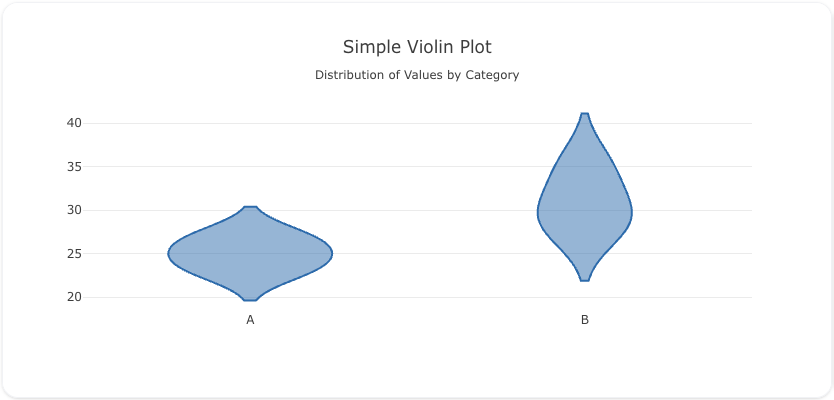
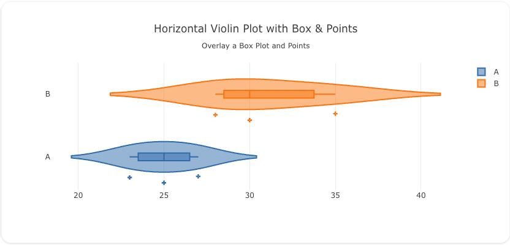
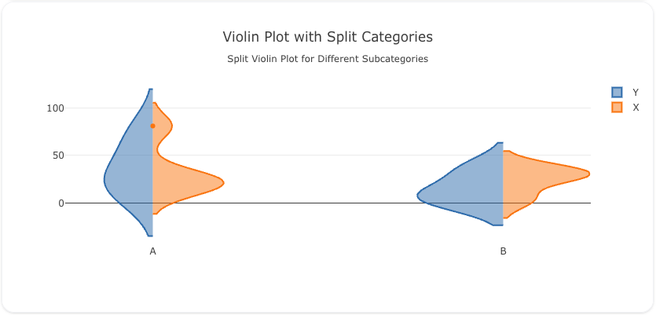

---
search:
  exclude: true
---
<!--start-->
## Overview

The `violin` trace type is used to create violin plots, which visualize the distribution of numerical data. Violin plots combine aspects of box plots and density plots to show the distribution of the data, including its probability density. They are ideal for comparing distributions between different categories.

You can customize the orientation, kernel density estimation, and colors to represent the distribution data effectively.

!!! tip "Common Uses"
    - **Distribution Analysis**: Visualizing the distribution of a dataset, similar to box plots but with additional information about the density of data.
    - **Comparing Categories**: Comparing the distribution of numerical data across different categories.
    - **Outlier Detection**: Identifying outliers and the shape of the data distribution.

_**Check out the [Attributes](../configuration/Trace/Props/Violin/#attributes) for the full set of configuration options**_

## Examples


!!! example "Common Configurations"

    === "Simple Violin Plot"

        Here's a simple `violin` plot showing the distribution of values for two categories:

        

        You can copy this code below to create this chart in your project:

        ```yaml
        models:
          - name: violin-data
            args:
              - echo
              - |
                category,value
                A,23
                A,25
                A,27
                B,30
                B,35
                B,28
        traces:
          - name: Simple Violin Plot
            model: ref(violin-data)
            props:
              type: violin
              x: query(category)
              y: query(value)
        charts:
          - name: Simple Violin Chart
            traces:
              - ref(Simple Violin Plot)
            layout:
              title:
                text: Simple Violin Plot<br><sub>Distribution of Values by Category</sub>
        ```

    === "Violin Plot with Box Overlay"

        This example demonstrates a `violin` plot with a box plot overlay and individual data points:

        

        Here's the code:

        ```yaml
        models:
          - name: violin-data-box
            args:
              - echo
              - |
                category,value
                A,23
                A,25
                A,27
                B,30
                B,35
                B,28
        traces:
          - name: Violin Plot with Box
            model: ref(violin-data-box)
            cohort_on: category
            props:
              type: violin
              y: query(category)
              x: query(value)
              orientation: h
              box: 
                visible: true
              points: "all"
              marker:
                symbol: "cross-dot"
        charts:
          - name: Violin Chart with Box
            traces:
              - ref(Violin Plot with Box)
            layout:
              title:
                text: Violin Plot with Box Overlay<br><sub>Distribution with Box Plot and Data Points</sub>
        ```

    === "Violin Plot with Split Categories"

        Here's a `violin` plot where the data is split by two categories, providing a side-by-side comparison of distributions:

        

        Here's the code:

        ```yaml
        models:
          - name: violin-data-split
            args:
              - echo
              - |
                category,sub_category,value
                A,X,23
                A,Y,25
                A,Y,70
                A,Y,15
                A,X,27
                A,X,13
                A,X,21
                A,X,81
                B,X,30
                B,X,35
                B,X,4
                B,Y,35
                B,Y,6
                B,Y,5
                B,X,28
        traces:
          - name: Violin Plot Category X
            model: ref(violin-data-split)
            cohort_on: sub_category
            props:
              type: violin
              side: positive
              x: query(category)
              y: query(value)
            filters: 
              - query( sub_category = 'X')
          - name: Violin Plot Category Y
            model: ref(violin-data-split)
            cohort_on: sub_category
            props:
              type: violin
              side: negative
              x: query(category)
              y: query(value)
            filters: 
              - query( sub_category = 'Y')
        charts:
          - name: Violin Chart with Split Categories
            traces:
              - ref(Violin Plot Category Y)
              - ref(Violin Plot Category X)
            layout:
              title:
                text: Violin Plot with Split Categories<br><sub>Side-by-Side Comparison of Distributions</sub>
        ```


<!--end-->