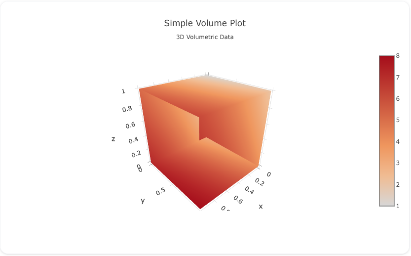

---
search:
  exclude: true
---
<!--start-->
## Overview

The `volume` trace type is used to create 3D volume plots, which visualize 3D volumetric data. Volume plots are useful for representing datasets where the values at each (x, y, z) point in a grid represent a density or scalar field, such as medical imaging, fluid dynamics, and other scientific data.

You can customize the opacity, surface levels, and colors to effectively visualize the internal structure of the volume.

!!! tip "Common Uses"
    - **Medical Imaging**: Visualizing 3D scans such as MRI or CT data.
    - **Fluid Dynamics**: Representing 3D fields of density or pressure.
    - **Scientific Visualization**: Displaying any 3D scalar field or volumetric data.

_**Check out the [Attributes](../configuration/Trace/Props/Volume/#attributes) for the full set of configuration options**_

## Examples


!!! example "Common Configurations"

    === "Simple Volume Plot"

        Here's a simple `volume` plot visualizing a 3D scalar field:

        

        You can copy this code below to create this chart in your project:

        ```yaml
        models:
          - name: isosurface-data-simple
            args:
              - echo
              - |
                idx,x,y,z,value
                0,0,0,1,1
                1,0,1,1,2
                2,0,0,0,3
                3,0,1,0,4
                4,1,0,1,5
                5,1,1,1,6
                6,1,0,0,7
                7,1,1,0,8

        traces:
          - name: Simple Isosurface Plot Trace
            model: ref(isosurface-data-simple)
            props:
              type: isosurface
              x: ?{x}
              y: ?{y}
              z: ?{z}
              value: ?{value}
              isomin: 2 
              isomax: 6 
              colorscale: "Reds"
            order_by: 
              - ?{ idx asc }
        charts:
          - name: Simple Isosurface Chart
            traces:
              - ref(Simple Isosurface Plot Trace)
            layout:
              title:
                text: Simple Isosurface Plot<br><sub>3D Volume Visualization</sub>
        ```


<!--end-->