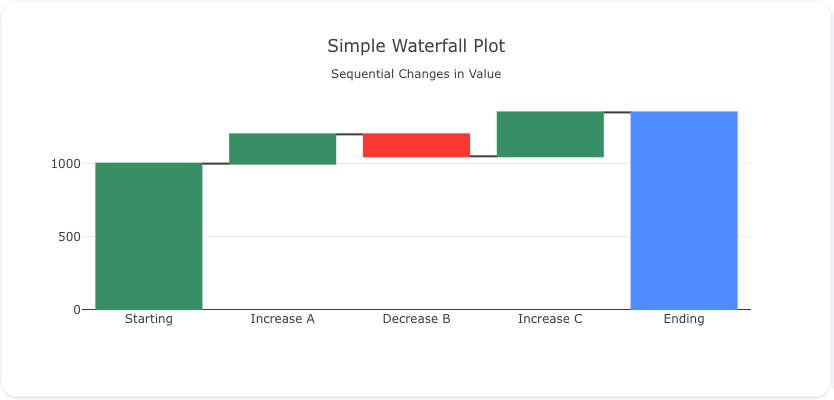
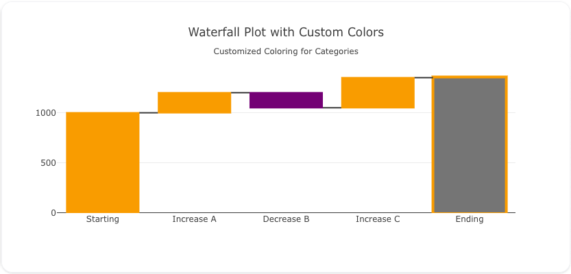

## Overview

The `waterfall` trace type is used to create waterfall charts, which are useful for visualizing incremental changes in value over a series of categories or time. Waterfall charts are commonly used in financial and analytical contexts to show how sequential positive or negative values affect an initial value.

You can customize the colors, connectors, and base values to represent your data effectively.

!!! tip "Common Uses"
    - **Financial Analysis**: Visualizing profit and loss over time or across categories.
    - **Incremental Changes**: Showing how individual positive or negative changes affect a starting value.
    - **Part-to-Whole Visualization**: Highlighting how parts contribute to a cumulative total.

_**Check out the [Attributes](../configuration/Trace/Props/Waterfall/#attributes) for the full set of configuration options**_

## Examples


!!! example "Common Configurations"

    === "Simple Waterfall Plot"

        Here's a simple `waterfall` plot showing incremental changes across categories:

        

        You can copy this code below to create this chart in your project:

        ```yaml
        models:
          - name: waterfall-data
            args:
              - echo
              - |
                label,value
                Starting,1000
                Increase A,200
                Decrease B,-150
                Increase C,300
                Ending,1350
        traces:
          - name: Simple Waterfall Plot
            model: ref(waterfall-data)
            props:
              type: waterfall
              x: query(label)
              y: query(value)
              measure: ["relative", "relative", "relative", "total"]
        charts:
          - name: Simple Waterfall Chart
            traces:
              - ref(Simple Waterfall Plot)
            layout:
              title:
                text: Simple Waterfall Plot<br><sub>Sequential Changes in Value</sub>
        ```

    === "Waterfall Plot with Custom Colors"

        This example demonstrates a `waterfall` plot where the bars have custom colors for different categories:

        

        Here's the code:

        ```yaml
        models:
          - name: waterfall-data-colors
            args:
              - echo
              - |
                label,value,color
                Starting,1000,#1f77b4
                Increase A,200,#2ca02c
                Decrease B,-150,#d62728
                Increase C,300,#ff7f0e
                Ending,1350,#9467bd
        traces:
          - name: Waterfall Plot with Custom Colors
            model: ref(waterfall-data-colors)
            props:
              type: waterfall
              x: query(label)
              y: query(value)
              measure: ["relative", "relative", "relative", "total"]
              marker:
                color: query(color)
        charts:
          - name: Waterfall Chart with Custom Colors
            traces:
              - ref(Waterfall Plot with Custom Colors)
            layout:
              title:
                text: Waterfall Plot with Custom Colors<br><sub>Customized Coloring for Categories</sub>
        ```

    === "Waterfall Plot with Connectors"

        Here's a `waterfall` plot where connectors are added between the bars, visually linking each stage of the incremental changes:

        

        Here's the code:

        ```yaml
        models:
          - name: waterfall-data-connectors
            args:
              - echo
              - |
                label,value
                Starting,1000
                Increase A,200
                Decrease B,-150
                Increase C,300
                Ending,1350
        traces:
          - name: Waterfall Plot with Connectors
            model: ref(waterfall-data-connectors)
            props:
              type: waterfall
              x: query(label)
              y: query(value)
              measure: ["relative", "relative", "relative", "total"]
              connector:
                line:
                  color: "black"
                  width: 2
        charts:
          - name: Waterfall Chart with Connectors
            traces:
              - ref(Waterfall Plot with Connectors)
            layout:
              title:
                text: Waterfall Plot with Connectors<br><sub>Visual Connections Between Stages</sub>
        ```


