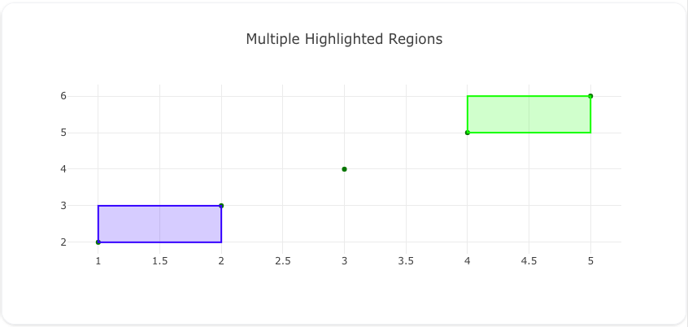
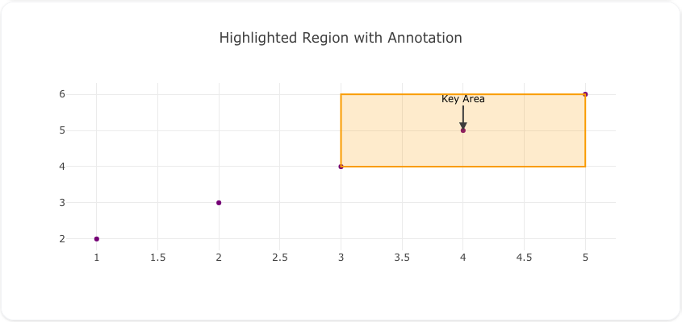
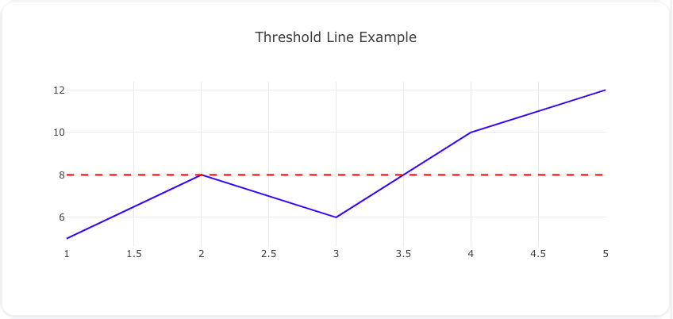
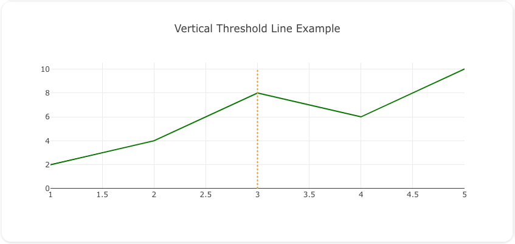
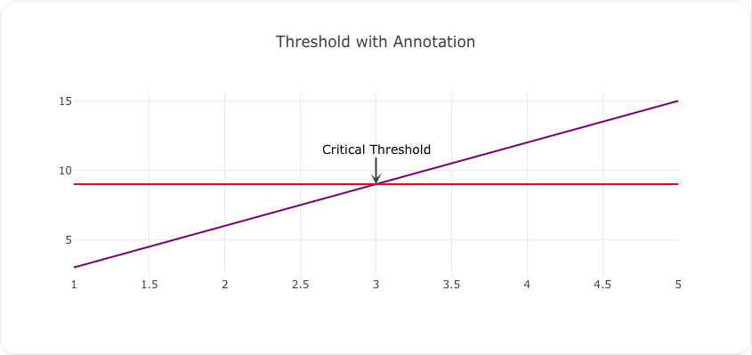
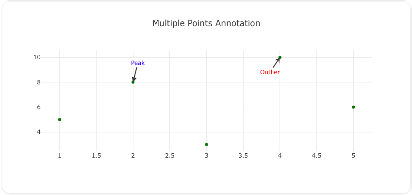
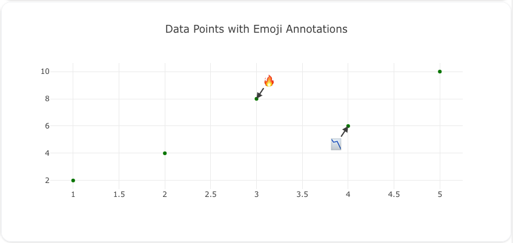
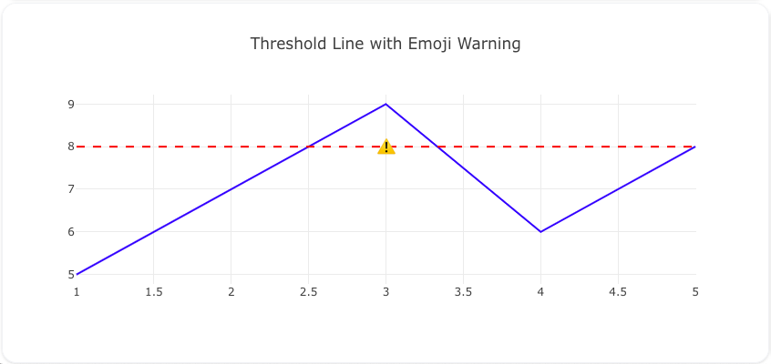
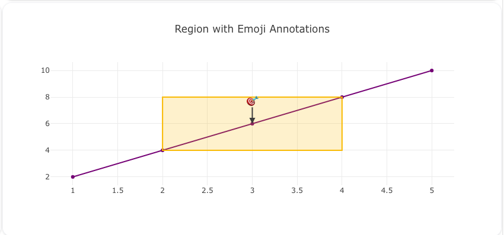

# Shapes and Annotations

## Introduction

Shapes and annotations are powerful tools in Visivo to enhance your visualizations by adding context, emphasis, and interactivity. 

!!! info "TLDR" 

    **Shapes** enable you to highlight [regions](#highlighting-regions) and set [thresholds/targets](#adding-thresholds-and-limits), while **annotations** help add [explanatory notes](#emoji-hover-text) or call attention to [specific data points](#annotating-key-points).

    Checkout the live [examples dashboard](https://examples.visivo.io/Annotation%20and%20Shape%20Examples). It brings to life the [examples below](#examples).

Both shapes and annotations are configured through the [layout](../reference/configuration/Chart/Layout/index.md) property of [charts](../reference/configuration/Chart/index.md).

_This guide explains how to use shapes and annotations in Visivo, including practical examples you can copy and paste into your projects._

---

### What are Shapes?

Shapes in Visivo allow you to draw graphical elements like lines, rectangles, and circles on your visualization. They can be used to highlight regions, denote thresholds, or emphasize trends.

!!! tip "Use Cases"
    - Highlight a time period in a time series chart :high_brightness:
    - Mark a threshold or limit with a line :chart_with_upwards_trend:
    - Show regions of interest in scatter plots :material-chart-scatter-plot:


### What are Annotations?

Annotations provide a way to add textual notes or labels to your visualizations. They can point to specific data points or regions, often with optional arrows for emphasis.

!!! tip "Use Cases"
    - Add explanatory text to a chart :information_source:
    - Emphasize outliers or anomalies :bangbang:
    - Provide detailed tooltips for better data understanding :writing_hand:
---
## Configuration Syntax
Shapes and annotations are defined in your [chart.layout](../reference/configuration/Chart/Layout/index.md) properties.
### Shapes

??? example

    ```yaml
    shapes:
     - type: rectangle
        x0: 10
        x1: 20
        y0: 5
        y1: 15
        line:
          color: red
          width: 2
        fillcolor: rgba(255, 0, 0, 0.2)
    ```

!!! info "Configuration"

    ``` yaml
    shapes:
      editable: 'boolean' # (1)!
      fillcolor: 'color' # (2)!
      fillrule: 'enumerated , one of ( "evenodd" | "nonzero" )' # (3)!
      layer: 'enumerated , one of ( "below" | "above" )' # (4)!
      line:
        color: 'color' # (5)!
        dash: 'string' # (6)!
        width: 'number greater than or equal to 0' #(7)!
      name: 'string' #(8)!
      opacity: 'number between or equal to 0 and 1' #(9)!
      path: 'string' #(10)!
      templateitemname: 'string' #(11)!
      type: 'enumerated , one of ( "circle" | "rect" | "path" | "line" )' #(12)!
      visible: 'boolean' #(13)!
      x0: 'number or categorical coordinate string' #(14)!
      x1: 'number or categorical coordinate string' #(15)!
      xanchor: 'number or categorical coordinate string' #(16)!
      xref: 'enumerated , one of ( "paper" | "/^x([2-9]|[1-9][0-9]+)?( domain)?$/" )' #(17)!
      xsizemode: 'enumerated , one of ( "scaled" | "pixel" )' #(18)!
      y0: 'number or categorical coordinate string' #(19)!
      y1: 'number or categorical coordinate string' #(20)!
      yanchor: 'number or categorical coordinate string' #(21)!
      yref: 'enumerated , one of ( "paper" | "/^y([2-9]|[1-9][0-9]+)?( domain)?$/" )' #(22)!
      ysizemode: 'enumerated , one of ( "scaled" | "pixel" )' #(23)!
    ```

    1. Determines whether the shape could be activated for edit or not. Has no effect when the older editable shapes mode is enabled via `config.editable` or `config.edits.shapePosition`. 
    2. Sets the color filling the shape's interior. Only applies to closed shapes. 
    3. Determines which regions of complex paths constitute the interior. For more info please visit https://developer.mozilla.org/en-US/docs/Web/SVG/Attribute/fill-rule 
    4. Specifies whether shapes are drawn below or above traces. 
    5. Sets the line color. 
    6. Sets the dash style of lines. Set to a dash type string ("solid", "dot", "dash", "longdash", "dashdot", or "longdashdot") or a dash length list in px (eg "5px,10px,2px,2px"). 
    7. Sets the line width (in px). 
    8. When used in a template, named items are created in the output figure in addition to any items the figure already has in this array. You can modify these items in the output figure by making your own item with `templateitemname` matching this `name` alongside your modifications (including `visible: false` or `enabled: false` to hide it). Has no effect outside of a template. 
    9. Sets the opacity of the shape. 
    10. For `type` "path" - a valid SVG path with the pixel values replaced by data values in `xsizemode`/`ysizemode` being "scaled" and taken unmodified as pixels relative to `xanchor` and `yanchor` in case of "pixel" size mode. There are a few restrictions / quirks only absolute instructions, not relative. So the allowed segments are: M, L, H, V, Q, C, T, S, and Z arcs (A) are not allowed because radius rx and ry are relative. In the future we could consider supporting relative commands, but we would have to decide on how to handle date and log axes. Note that even as is, Q and C Bezier paths that are smooth on linear axes may not be smooth on log, and vice versa. no chained "polybezier" commands - specify the segment type for each one. On category axes, values are numbers scaled to the serial numbers of categories because using the categories themselves there would be no way to describe fractional positions On data axes: because space and T are both normal components of path strings, we can't use either to separate date from time parts. Therefore we'll use underscore for this purpose: 2015-02-21_13:45:56.789 
    11. Used to refer to a named item in this array in the template. Named items from the template will be created even without a matching item in the input figure, but you can modify one by making an item with `templateitemname` matching its `name`, alongside your modifications (including `visible: false` or `enabled: false` to hide it). If there is no template or no matching item, this item will be hidden unless you explicitly show it with `visible: true`. 
    12. Specifies the shape type to be drawn. If "line", a line is drawn from (`x0`,`y0`) to (`x1`,`y1`) with respect to the axes' sizing mode. If "circle", a circle is drawn from ((`x0`+`x1`)/2, (`y0`+`y1`)/2)) with radius (|(`x0`+`x1`)/2 - `x0`|, |(`y0`+`y1`)/2 -`y0`)|) with respect to the axes' sizing mode. If "rect", a rectangle is drawn linking (`x0`,`y0`), (`x1`,`y0`), (`x1`,`y1`), (`x0`,`y1`), (`x0`,`y0`) with respect to the axes' sizing mode. If "path", draw a custom SVG path using `path`. with respect to the axes' sizing mode. 
    13. Determines whether or not this shape is visible. 
    14. Sets the shape's starting x position. See `type` and `xsizemode` for more info. 
    15. Sets the shape's end x position. See `type` and `xsizemode` for more info. 
    16. Only relevant in conjunction with `xsizemode` set to "pixel". Specifies the anchor point on the x axis to which `x0`, `x1` and x coordinates within `path` are relative to. E.g. useful to attach a pixel sized shape to a certain data value. No effect when `xsizemode` not set to "pixel". 
    17. Sets the shape's x coordinate axis. If set to a x axis id (e.g. "x" or "x2"), the `x` position refers to a x coordinate. If set to "paper", the `x` position refers to the distance from the left of the plotting area in normalized coordinates where "0" ("1") corresponds to the left (right). If set to a x axis ID followed by "domain" (separated by a space), the position behaves like for "paper", but refers to the distance in fractions of the domain length from the left of the domain of that axis: e.g., "x2 domain" refers to the domain of the second x axis and a x position of 0.5 refers to the point between the left and the right of the domain of the second x axis. 
    18. Sets the shapes's sizing mode along the x axis. If set to "scaled", `x0`, `x1` and x coordinates within `path` refer to data values on the x axis or a fraction of the plot area's width (`xref` set to "paper"). If set to "pixel", `xanchor` specifies the x position in terms of data or plot fraction but `x0`, `x1` and x coordinates within `path` are pixels relative to `xanchor`. This way, the shape can have a fixed width while maintaining a position relative to data or plot fraction. 
    19. Sets the shape's starting y position. See `type` and `ysizemode` for more info. 
    20. Sets the shape's end y position. See `type` and `ysizemode` for more info. 
    21. Only relevant in conjunction with `ysizemode` set to "pixel". Specifies the anchor point on the y axis to which `y0`, `y1` and y coordinates within `path` are relative to. E.g. useful to attach a pixel sized shape to a certain data value. No effect when `ysizemode` not set to "pixel". 
    22. Sets the shape's y coordinate axis. If set to a y axis id (e.g. "y" or "y2"), the `y` position refers to a y coordinate. If set to "paper", the `y` position refers to the distance from the bottom of the plotting area in normalized coordinates where "0" ("1") corresponds to the bottom (top). If set to a y axis ID followed by "domain" (separated by a space), the position behaves like for "paper", but refers to the distance in fractions of the domain length from the bottom of the domain of that axis: e.g., "y2 domain" refers to the domain of the second y axis and a y position of 0.5 refers to the point between the bottom and the top of the domain of the second y axis. 
    23. Sets the shapes's sizing mode along the y axis. If set to "scaled", `y0`, `y1` and y coordinates within `path` refer to data values on the y axis or a fraction of the plot area's height (`yref` set to "paper"). If set to "pixel", `yanchor` specifies the y position in terms of data or plot fraction but `y0`, `y1` and y coordinates within `path` are pixels relative to `yanchor`. This way, the shape can have a fixed height while maintaining a position relative to data or plot fraction.


### Annotations
The configuration options for annotations are quite extensive; however, they are pretty simple to set up most of the time (see example).
??? example

    ```yaml
    annotations:
      - x: 15
        y: 10
        text: "Important Point"
        showarrow: true
        arrowhead: 2
        ax: 0
        ay: -40
        font:
          size: 12
          color: blue
    ```

!!! info "Configuration"

    ``` yaml 
    annotations:
      align: 'enumerated , one of ( "left" | "center" | "right" )' #(1)!
      arrowcolor: 'color' #(2)!
      arrowhead: 'integer between or equal to 0 and 8' #(3)!
      arrowside: 'flaglist string. any combination of "end", "start" joined with a "+" or "none".' #(4)!
      arrowsize: 'number greater than or equal to 0.3' #(5)!
      arrowwidth: 'number greater than or equal to 0.1' #(6)!
      ax: 'number or categorical coordinate string' #(7)!
      axref: 'enumerated , one of ( "pixel" | "/^x([2-9]|[1-9][0-9]+)?( domain)?$/" )' #(8)!
      ay: 'number or categorical coordinate string' #(9)!
      ayref: 'enumerated , one of ( "pixel" | "/^y([2-9]|[1-9][0-9]+)?( domain)?$/" )' #(10)!
      bgcolor: 'color' #(11)!
      bordercolor: 'color' #(12)!
      borderpad: 'number greater than or equal to 0' #(13)!
      borderwidth: 'number greater than or equal to 0' #(14)!
      captureevents: 'boolean' #(15)!
      clicktoshow: 'enumerated , one of ( false | "onoff" | "onout" )' #(16)!
      font:
        color: color
        family: 'string' #(17)!
        size: number greater than or equal to 1
      height: 'number greater than or equal to 1' #(18)!
      hoverlabel:
        bgcolor: 'color' #(19)!
        bordercolor: 'color' #(20)!
        font:
          color: color
          family: 'string' #(21)!
          size: number greater than or equal to 1
      hovertext: 'string' #(22)!
      name: 'string' #(23)!
      opacity: 'number between or equal to 0 and 1' #(24)!
      showarrow: 'boolean' #(25)!
      standoff: 'number greater than or equal to 0' #(26)!
      startarrowhead: 'integer between or equal to 0 and 8' #(27)!
      startarrowsize: 'number greater than or equal to 0.3' #(28)!
      startstandoff: 'number greater than or equal to 0' #(29)!
      templateitemname: 'string' #(30)!
      text: 'string' #(31)!
      textangle: 'angle' #(32)!
      valign: 'enumerated , one of ( "top" | "middle" | "bottom" )' #(33)!
      visible: 'boolean' #(34)!
      width: 'number greater than or equal to 1' #(35)!
      x: 'number or categorical coordinate string' #(36)!
      xanchor: 'enumerated , one of ( "auto" | "left" | "center" | "right" )' #(37)!
      xclick: 'number or categorical coordinate string' #(38)!
      xref: 'enumerated , one of ( "paper" | "/^x([2-9]|[1-9][0-9]+)?( domain)?$/" )' #(39)!
      xshift: 'number' #(40)!
      y: 'number or categorical coordinate string' #(41)!
      yanchor: 'enumerated , one of ( "auto" | "top" | "middle" | "bottom" ) #(42)!
      yclick: 'number or categorical coordinate string' #(43)!
      yref: 'enumerated , one of ( "paper" | "/^y([2-9]|[1-9][0-9]+)?( domain)?$/" )' #(44)!
      yshift: 'number' #(45)!
    ```

    1. HTML tags or if an explicit width is set to override the text width. 
    2. Sets the color of the annotation arrow. 
    3. Sets the end annotation arrow head style. 
    4. Sets the annotation arrow head position. 
    5. Sets the size of the end annotation arrow head, relative to `arrowwidth`. A value of 1 (default) gives a head about 3x as wide as the line. 
    6. Sets the width (in px) of annotation arrow line. 
    7. Sets the x component of the arrow tail about the arrow head. If `axref` is `pixel`, a positive (negative) component corresponds to an arrow pointing from right to left (left to right). If `axref` is not `pixel` and is exactly the same as `xref`, this is an absolute value on that axis, like `x`, specified in the same coordinates as `xref`. 
    8. Indicates in what coordinates the tail of the annotation (ax,ay) is specified. If set to a x axis id (e.g. "x" or "x2"), the `x` position refers to a x coordinate. If set to "paper", the `x` position refers to the distance from the left of the plotting area in normalized coordinates where "0" ("1") corresponds to the left (right). If set to a x axis ID followed by "domain" (separated by a space), the position behaves like for "paper", but refers to the distance in fractions of the domain length from the left of the domain of that axis: e.g., "x2 domain" refers to the domain of the second x axis and a x position of 0.5 refers to the point between the left and the right of the domain of the second x axis. In order for absolute positioning of the arrow to work, "axref" must be exactly the same as "xref", otherwise "axref" will revert to "pixel" (explained next). For relative positioning, "axref" can be set to "pixel", in which case the "ax" value is specified in pixels relative to "x". Absolute positioning is useful for trendline annotations which should continue to indicate the correct trend when zoomed. Relative positioning is useful for specifying the text offset for an annotated point. 
    9. Sets the y component of the arrow tail about the arrow head. If `ayref` is `pixel`, a positive (negative) component corresponds to an arrow pointing from bottom to top (top to bottom). If `ayref` is not `pixel` and is exactly the same as `yref`, this is an absolute value on that axis, like `y`, specified in the same coordinates as `yref`. 
    10. Indicates in what coordinates the tail of the annotation (ax,ay) is specified. If set to a y axis id (e.g. "y" or "y2"), the `y` position refers to a y coordinate. If set to "paper", the `y` position refers to the distance from the bottom of the plotting area in normalized coordinates where "0" ("1") corresponds to the bottom (top). If set to a y axis ID followed by "domain" (separated by a space), the position behaves like for "paper", but refers to the distance in fractions of the domain length from the bottom of the domain of that axis: e.g., "y2 domain" refers to the domain of the second y axis and a y position of 0.5 refers to the point between the bottom and the top of the domain of the second y axis. In order for absolute positioning of the arrow to work, "ayref" must be exactly the same as "yref", otherwise "ayref" will revert to "pixel" (explained next). For relative positioning, "ayref" can be set to "pixel", in which case the "ay" value is specified in pixels relative to "y". Absolute positioning is useful for trendline annotations which should continue to indicate the correct trend when zoomed. Relative positioning is useful for specifying the text offset for an annotated point. 
    11. Sets the background color of the annotation. 
    12. Sets the color of the border enclosing the annotation `text`. 
    13. Sets the padding (in px) between the `text` and the enclosing border. 
    14. Sets the width (in px) of the border enclosing the annotation `text`. 
    15. Determines whether the annotation text box captures mouse move and click events, or allows those events to pass through to data points in the plot that may be behind the annotation. By default `captureevents` is "false" unless `hovertext` is provided. If you use the event `plotly_clickannotation` without `hovertext` you must explicitly enable `captureevents`. 
    16. Makes this annotation respond to clicks on the plot. If you click a data point that exactly matches the `x` and `y` values of this annotation, and it is hidden (visible: false), it will appear. In "onoff" mode, you must click the same point again to make it disappear, so if you click multiple points, you can show multiple annotations. In "onout" mode, a click anywhere else in the plot (on another data point or not) will hide this annotation. If you need to show/hide this annotation in response to different `x` or `y` values, you can set `xclick` and/or `yclick`. This is useful for example to label the side of a bar. To label markers though, `standoff` is preferred over `xclick` and `yclick`. 
    17. HTML font family - the typeface that will be applied by the web browser. The web browser will only be able to apply a font if it is available on the system which it operates. Provide multiple font families, separated by commas, to indicate the preference in which to apply fonts if they aren't available on the system. The Chart Studio Cloud (at https://chart-studio.plotly.com or on-premise) generates images on a server, where only a select number of fonts are installed and supported. These include "Arial", "Balto", "Courier New", "Droid Sans",, "Droid Serif", "Droid Sans Mono", "Gravitas One", "Old Standard TT", "Open Sans", "Overpass", "PT Sans Narrow", "Raleway", "Times New Roman". 
    18. Sets an explicit height for the text box. null (default) lets the text set the box height. Taller text will be clipped. 
    19. Sets the background color of the hover label. By default uses the annotation's `bgcolor` made opaque, or white if it was transparent. 
    20. Sets the border color of the hover label. By default uses either dark grey or white, for maximum contrast with `hoverlabel.bgcolor`. 
    21. HTML font family - the typeface that will be applied by the web browser. The web browser will only be able to apply a font if it is available on the system which it operates. Provide multiple font families, separated by commas, to indicate the preference in which to apply fonts if they aren't available on the system. The Chart Studio Cloud (at https://chart-studio.plotly.com or on-premise) generates images on a server, where only a select number of fonts are installed and supported. These include "Arial", "Balto", "Courier New", "Droid Sans",, "Droid Serif", "Droid Sans Mono", "Gravitas One", "Old Standard TT", "Open Sans", "Overpass", "PT Sans Narrow", "Raleway", "Times New Roman". 
    22. Sets text to appear when hovering over this annotation. If omitted or blank, no hover label will appear. 
    23. When used in a template, named items are created in the output figure in addition to any items the figure already has in this array. You can modify these items in the output figure by making your own item with `templateitemname` matching this `name` alongside your modifications (including `visible: false` or `enabled: false` to hide it). Has no effect outside of a template. 
    24. Sets the opacity of the annotation (text + arrow). 
    25. Determines whether or not the annotation is drawn with an arrow. If "true", `text` is placed near the arrow's tail. If "false", `text` lines up with the `x` and `y` provided. 
    26. Sets a distance, in pixels, to move the end arrowhead away from the position it is pointing at, for example to point at the edge of a marker independent of zoom. Note that this shortens the arrow from the `ax` / `ay` vector, in contrast to `xshift` / `yshift` which moves everything by this amount. 
    27. Sets the start annotation arrow head style. 
    28. Sets the size of the start annotation arrow head, relative to `arrowwidth`. A value of 1 (default) gives a head about 3x as wide as the line. 
    29. Sets a distance, in pixels, to move the start arrowhead away from the position it is pointing at, for example to point at the edge of a marker independent of zoom. Note that this shortens the arrow from the `ax` / `ay` vector, in contrast to `xshift` / `yshift` which moves everything by this amount. 
    30. Used to refer to a named item in this array in the template. Named items from the template will be created even without a matching item in the input figure, but you can modify one by making an item with `templateitemname` matching its `name`, alongside your modifications (including `visible: false` or `enabled: false` to hide it). If there is no template or no matching item, this item will be hidden unless you explicitly show it with `visible: true`. 
    31. ), bold (<b></b>), italics (<i></i>), hyperlinks. Tags <em>, <sup>, <sub> <span> are also supported. 
    32. Sets the angle at which the `text` is drawn with respect to the horizontal. 
    33. Sets the vertical alignment of the `text` within the box. Has an effect only if an explicit height is set to override the text height. 
    34. Determines whether or not this annotation is visible. 
    35.  to start a new line. 
    36. Sets the annotation's x position. If the axis `type` is "log", then you must take the log of your desired range. If the axis `type` is "date", it should be date strings, like date data, though Date objects and unix milliseconds will be accepted and converted to strings. If the axis `type` is "category", it should be numbers, using the scale where each category is assigned a serial number from zero in the order it appears. 
    37. Sets the text box's horizontal position anchor This anchor binds the `x` position to the "left", "center" or "right" of the annotation. For example, if `x` is set to 1, `xref` to "paper" and `xanchor` to "right" then the right-most portion of the annotation lines up with the right-most edge of the plotting area. If "auto", the anchor is equivalent to "center" for data-referenced annotations or if there is an arrow, whereas for paper-referenced with no arrow, the anchor picked corresponds to the closest side. 
    38. Toggle this annotation when clicking a data point whose `x` value is `xclick` rather than the annotation's `x` value. 
    39. Sets the annotation's x coordinate axis. If set to a x axis id (e.g. "x" or "x2"), the `x` position refers to a x coordinate. If set to "paper", the `x` position refers to the distance from the left of the plotting area in normalized coordinates where "0" ("1") corresponds to the left (right). If set to a x axis ID followed by "domain" (separated by a space), the position behaves like for "paper", but refers to the distance in fractions of the domain length from the left of the domain of that axis: e.g., "x2 domain" refers to the domain of the second x axis and a x position of 0.5 refers to the point between the left and the right of the domain of the second x axis. 
    40. Shifts the position of the whole annotation and arrow to the right (positive) or left (negative) by this many pixels. 
    41. Sets the annotation's y position. If the axis `type` is "log", then you must take the log of your desired range. If the axis `type` is "date", it should be date strings, like date data, though Date objects and unix milliseconds will be accepted and converted to strings. If the axis `type` is "category", it should be numbers, using the scale where each category is assigned a serial number from zero in the order it appears. 
    42. Sets the text box's vertical position anchor This anchor binds the `y` position to the "top", "middle" or "bottom" of the annotation. For example, if `y` is set to 1, `yref` to "paper" and `yanchor` to "top" then the top-most portion of the annotation lines up with the top-most edge of the plotting area. If "auto", the anchor is equivalent to "middle" for data-referenced annotations or if there is an arrow, whereas for paper-referenced with no arrow, the anchor picked corresponds to the closest side. 
    43. Toggle this annotation when clicking a data point whose `y` value is `yclick` rather than the annotation's `y` value. 
    44. Sets the annotation's y coordinate axis. If set to a y axis id (e.g. "y" or "y2"), the `y` position refers to a y coordinate. If set to "paper", the `y` position refers to the distance from the bottom of the plotting area in normalized coordinates where "0" ("1") corresponds to the bottom (top). If set to a y axis ID followed by "domain" (separated by a space), the position behaves like for "paper", but refers to the distance in fractions of the domain length from the bottom of the domain of that axis: e.g., "y2 domain" refers to the domain of the second y axis and a y position of 0.5 refers to the point between the bottom and the top of the domain of the second y axis. 
    45. Shifts the position of the whole annotation and arrow up (positive) or down (negative) by this many pixels.


---

## Examples

Below are examples demonstrating how to use shapes and annotations in Visivo charts. The examples are grouped into tabs for easy navigation.


### **Highlighting Regions**
Highlighting regions in your charts helps draw attention to important areas or patterns in your data. You can use shapes like rectangles or circles to emphasize specific time periods, value ranges, or clusters of data points. The transparency of the fill color allows the underlying data to remain visible while still clearly marking the region of interest.

=== "Highlight a Region"
    This example shows how to highlight a specific region in a scatter plot using a rectangle shape.

    

    !!! example "Code"

        ``` yaml
        models:
          - name: scatter_data
            args:
              - echo
              - |
                x,y
                1,2
                2,3
                3,4
                4,5
                5,6
    
        traces:
          - name: scatter_trace
            model: ${ref(scatter_data)}
            props:
              type: scatter
              x: ?{x}
              y: ?{y}
              mode: markers
              marker:
                color: blue
    
        charts:
          - name: scatter_with_rectangle
            traces:
              - ${ref(scatter_trace)}
            layout:
              title: Highlighted Region in Scatter Plot
              shapes:
                - type: rect
                  x0: 2
                  x1: 4
                  y0: 3
                  y1: 5
                  line:
                    color: rgba(255, 0, 0, 1)
                    width: 2
                  fillcolor: rgba(255, 0, 0, 0.2)
        ```

=== "Mark Multiple Regions"
    This example demonstrates how to mark multiple regions on a scatter plot using rectangles.

    

    !!! example "Code"

        ``` yaml
        models:
          - name: scatter_data
            args:
              - echo
              - |
                x,y
                1,2
                2,3
                3,4
                4,5
                5,6
    
        traces:
          - name: scatter_trace
            model: ${ref(scatter_data)}
            props:
              type: scatter
              x: ?{x}
              y: ?{y}
              mode: markers
              marker:
                color: green
    
        charts:
          - name: scatter_with_multiple_regions
            traces:
              - ${ref(scatter_trace)}
            layout:
              title: Multiple Highlighted Regions
              shapes:
                - type: rect
                  x0: 1
                  x1: 2
                  y0: 2
                  y1: 3
                  line:
                    color: rgba(0, 0, 255, 1)
                    width: 2
                  fillcolor: rgba(0, 0, 255, 0.2)
                - type: rect
                  x0: 4
                  x1: 5
                  y0: 5
                  y1: 6
                  line:
                    color: rgba(0, 255, 0, 1)
                    width: 2
                  fillcolor: rgba(0, 255, 0, 0.2)
        ```

=== "Region with Annotation"
    This example shows how to combine a rectangle shape with an annotation to explain its significance.

    

    !!! example "Code"

        ``` yaml
        models:
          - name: scatter_data
            args:
              - echo
              - |
                x,y
                1,2
                2,3
                3,4
                4,5
                5,6

        traces:
          - name: scatter_trace
            model: ${ref(scatter_data)}
            props:
              type: scatter
              x: ?{x}
              y: ?{y}
              mode: markers
              marker:
                color: purple

        charts:
          - name: scatter_with_region_annotation
            traces:
              - ${ref(scatter_trace)}
            layout:
              title: Highlighted Region with Annotation
              shapes:
                - type: rect
                  x0: 3
                  x1: 5
                  y0: 4
                  y1: 6
                  line:
                    color: rgba(255, 165, 0, 1)
                    width: 2
                  fillcolor: rgba(255, 165, 0, 0.2)
              annotations:
                - x: 4
                  y: 5
                  text: "Key Area"
                  showarrow: true
                  arrowhead: 2
                  ax: 0
                  ay: -40
                  font:
                    size: 12
                    color: black
        ```

---

### **Adding Thresholds and Limits**
Thresholds and limits are powerful tools for tracking goals, targets, and critical boundaries in your data visualizations. They help viewers quickly identify when values cross important thresholds and provide visual context for performance metrics.

=== "Threshold Line"
    Add a horizontal threshold line to indicate a limit on the y-axis.

    

    !!! example "Code"

        ```yaml
        models:
          - name: line_data
            args:
              - echo
              - |
                x,y
                1,5
                2,8
                3,6
                4,10
                5,12
    
        traces:
          - name: line_trace
            model: ${ref(line_data)}
            props:
              type: scatter
              x: ?{x}
              y: ?{y}
              mode: lines
              line:
                color: blue
    
        charts:
          - name: line_with_threshold
            traces:
              - ${ref(line_trace)}
            layout:
              title: Threshold Line Example
              shapes:
                - type: line
                  x0: 1
                  x1: 5
                  y0: 8
                  y1: 8
                  line:
                    color: red
                    width: 2
                    dash: dash
        ```

=== "Vertical Threshold"
    Add a vertical line for x-axis thresholds.

    

    !!! example "Code"

        ```yaml
        models:
          - name: vertical_threshold_data
            args:
              - echo
              - |
                x,y
                1,2
                2,4
                3,8
                4,6
                5,10

        traces:
          - name: vertical_line_trace
            model: ${ref(vertical_threshold_data)}
            props:
              type: scatter
              x: ?{x}
              y: ?{y}
              mode: lines
              line:
                color: green

        charts:
          - name: vertical_line_threshold
            traces:
              - ${ref(vertical_line_trace)}
            layout:
              title: Vertical Threshold Line Example
              shapes:
                - type: line
                  x0: 3
                  x1: 3
                  y0: 0
                  y1: 10
                  line:
                    color: orange
                    width: 2
                    dash: dot
        ```

=== "Threshold with Annotation"
    Combine threshold line with annotation for explanation.

    

    !!! example "Code"

        ```yaml
        models:
          - name: threshold_annotation_data
            args:
              - echo
              - |
                x,y
                1,3
                2,6
                3,9
                4,12
                5,15

        traces:
          - name: threshold_annotation_trace
            model: ${ref(threshold_annotation_data)}
            props:
              type: scatter
              x: ?{x}
              y: ?{y}
              mode: lines
              line:
                color: purple

        charts:
          - name: threshold_with_annotation
            traces:
              - ${ref(threshold_annotation_trace)}
            layout:
              title: Threshold with Annotation
              shapes:
                - type: line
                  x0: 1
                  x1: 5
                  y0: 9
                  y1: 9
                  line:
                    color: red
                    width: 2
                    dash: solid
              annotations:
                - x: 3
                  y: 9
                  text: "Critical Threshold"
                  showarrow: true
                  arrowhead: 3
                  ax: 0
                  ay: -40
                  font:
                    size: 14
                    color: black
        ```

---

### **Annotating Key Points**
Key points are data points that are particularly important or noteworthy. Annotating these points helps viewers understand the significance of specific data points and draw attention to them.

=== "Multiple Points"
    Annotate multiple outliers or key points.

    

    !!! example "Code"  

        ```yaml
        models:
          - name: multiple_points_data
            args:
              - echo
              - |
                x,y
                1,5
                2,8
                3,3
                4,10
                5,6

        traces:
          - name: multiple_points_trace
            model: ${ref(multiple_points_data)}
            props:
              type: scatter
              x: ?{x}
              y: ?{y}
              mode: markers
              marker:
                color: green

        charts:
          - name: multiple_points_annotation
            traces:
              - ${ref(multiple_points_trace)}
            layout:
              title: Multiple Points Annotation
              annotations:
                - x: 2
                  y: 8
                  text: "Peak"
                  showarrow: true
                  arrowhead: 2
                  ax: 10
                  ay: -40
                  font:
                    size: 12
                    color: blue
                - x: 4
                  y: 10
                  text: "Outlier"
                  showarrow: true
                  arrowhead: 3
                  ax: -20
                  ay: 30
                  font:
                    size: 12
                    color: red
        ```

=== "Point with Region"
    Combine point annotation with region highlighting.

    !!! example "Code"

        ```yaml
        models:
          - name: point_region_data
            args:
              - echo
              - |
                x,y
                1,3
                2,6
                3,9
                4,12
                5,15

        traces:
          - name: point_region_trace
            model: ${ref(point_region_data)}
            props:
              type: scatter
              x: ?{x}
              y: ?{y}
              mode: markers
              marker:
                color: purple

        charts:
          - name: point_with_region
            traces:
              - ${ref(point_region_trace)}
            layout:
              title: Point with Region
              shapes:
                - type: rect
                  x0: 2
                  x1: 4
                  y0: 6
                  y1: 12
                  line:
                    color: rgba(255, 165, 0, 1)
                    width: 2
                  fillcolor: rgba(255, 165, 0, 0.2)
              annotations:
                - x: 3
                  y: 9
                  text: "Important Area"
                  showarrow: true
                  arrowhead: 2
                  ax: 0
                  ay: -50
                  font:
                    size: 14
                    color: black
        ```

---
### **Emoji Hover Text**

Emoji annotations are a creative way to add small, non-intrusive icons to your charts. By using hover effects, they can provide additional context or explanations without overcrowding the visualization. This section demonstrates how to implement emoji annotations effectively in Visivo.

!!! tip "Best Practices"

    - Keep emoji usage relevant and avoid overloading the chart.
    - Use hover effects for additional context to avoid clutter.
    - Choose emojis that clearly communicate the intended meaning.

Below are three examples showcasing the use of emoji annotations.

=== "Highlight Data Points with Emojis"
    This example shows how to annotate specific data points with emojis.

    

    !!! example "Code"

        ```yaml
        models:
          - name: emoji_data
            args:
              - echo
              - |
                x,y
                1,2
                2,4
                3,8
                4,6
                5,10

        traces:
          - name: emoji_trace
            model: ${ref(emoji_data)}
            props:
              type: scatter
              x: ?{x}
              y: ?{y}
              mode: markers
              marker:
                color: green

        charts:
          - name: emoji_annotations_chart
            traces:
              - ${ref(emoji_trace)}
            layout:
              title: Emoji Annotations for Data Points
              annotations:
                - x: 3
                  y: 8
                  text: "🔥"
                  showarrow: true
                  arrowhead: 3
                  ax: 0
                  ay: -30
                  hovertext: "This is the peak value"
                  font:
                    size: 16
                - x: 5
                  y: 10
                  text: "🎯"
                  showarrow: true
                  arrowhead: 3
                  ax: 0
                  ay: -40
                  hovertext: "Target achieved!"
                  font:
                    size: 16
        ```

=== "Use Emojis to Highlight Thresholds"
    Combine emojis with threshold lines for better visualization.

    
    
    !!! example "Code"

        ```yaml
        models:
          - name: threshold_emoji_data
            args:
              - echo
              - |
                x,y
                1,5
                2,8
                3,6
                4,10
                5,12

        traces:
          - name: threshold_emoji_trace
            model: ${ref(threshold_emoji_data)}
            props:
              type: scatter
              x: ?{x}
              y: ?{y}
              mode: lines
              line:
                color: blue

        charts:
          - name: threshold_with_emojis
            traces:
              - ${ref(threshold_emoji_trace)}
            layout:
              title: Threshold Line with Emojis
              shapes:
                - type: line
                  x0: 1
                  x1: 5
                  y0: 8
                  y1: 8
                  line:
                    color: red
                    width: 2
                    dash: dash
              annotations:
                - x: 3
                  y: 8
                  text: "⚠️"
                  showarrow: false
                  hovertext: "Warning: Threshold crossed"
                  font:
                    size: 16
        ```

=== "Combine Emojis and Regions"
    Use emojis to annotate regions of interest.

    

    !!! example "Code"

        ```yaml
        models:
          - name: region_emoji_data
            args:
              - echo
              - |
                x,y
                1,2
                2,4
                3,6
                4,8
                5,10

        traces:
          - name: region_emoji_trace
            model: ${ref(region_emoji_data)}
            props:
              type: scatter
              x: ?{x}
              y: ?{y}
              mode: markers
              marker:
                color: orange

        charts:
          - name: region_with_emojis
            traces:
              - ${ref(region_emoji_trace)}
            layout:
              title: Region Highlighted with Emojis
              shapes:
                - type: rect
                  x0: 2
                  x1: 4
                  y0: 4
                  y1: 8
                  line:
                    color: rgba(0, 0, 255, 1)
                    width: 2
                  fillcolor: rgba(0, 0, 255, 0.2)
              annotations:
                - x: 3
                  y: 6
                  text: "💡"
                  showarrow: false
                  hovertext: "Interesting data here"
                  font:
                    size: 16
        ```

---

With these examples, you can creatively use emoji annotations to make your charts more engaging and informative.


## Best Practices

### Colors and Styling
- Use consistent colors throughout your visualizations for better readability
- Choose contrasting colors between shapes/annotations and the underlying data
- Consider color-blind friendly palettes when selecting colors
- Use semi-transparent fill colors for shapes to avoid obscuring data points
- Maintain consistent font styles and sizes across annotations

### Layout and Positioning 
- Position annotations to minimize overlap with data points
- Use arrow positions strategically to point to exact features
- Leave adequate whitespace around annotations for readability
- Consider the chart's aspect ratio when placing shapes and annotations

### Content and Clarity
- Write clear, concise annotation text that adds meaningful context
- Avoid excessive use of shapes/annotations to prevent visual clutter
- Ensure all shapes and annotations serve a specific purpose
- Use hover text for additional details rather than cramming text into annotations
- Group related annotations visually when possible

### Technical Considerations
- Test annotations at different screen sizes to ensure readability
- Verify that shapes scale appropriately with zoom levels
- Consider using templates for consistent annotation styling
- Document any custom annotation styles in your configuration

---

With these examples and best practices, you can explore the full power of shapes and annotations in Visivo while creating clear and effective visualizations.
