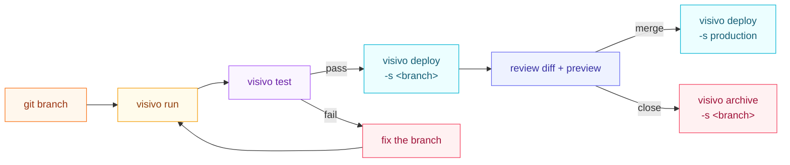

# CI/CD for BI

Visivo lets you treat business intelligence like software: every dashboard change goes through a git branch, gets verified by `visivo test`, and ships to a named stage with `visivo deploy -s <stage>`. This page walks the Git-review and staged-deploy workflow, then turns it into a real CI/CD pipeline.

!!! visivo "BI-as-code in one line"
    Because your project is YAML in git, the same review and release discipline you use for application code applies to your charts: branch, test computed values, and promote a build through dev, CI, and production stages side by side.

## The four commands

The whole workflow rests on four real CLI commands. Each links to its full reference.

<div class="grid cards" markdown>

-   :material-source-branch:{ .lg .middle .vz-source } **`visivo run`**

    ---

    Compiles the project and runs the model and insight queries to fetch the data that powers your dashboards, writing the results to the output directory.

    [:octicons-arrow-right-24: run](../reference/cli.md#run)

-   :material-test-tube:{ .lg .middle .vz-insight } **`visivo test`**

    ---

    Runs the project's tests, asserting on the computed insight values so the charts you ship have the characteristics you expect.

    [:octicons-arrow-right-24: test](../reference/cli.md#test)

-   :material-rocket-launch:{ .lg .middle .vz-metric } **`visivo deploy -s <stage>`**

    ---

    Pushes the current project and its computed data to [app.visivo.io](https://app.visivo.io) under a named stage. The `-s` / `--stage` flag is required.

    [:octicons-arrow-right-24: deploy](../reference/cli.md#deploy)

-   :material-archive:{ .lg .middle .vz-dashboard } **`visivo archive -s <stage>`**

    ---

    Tears down a stage you no longer need. This is the natural cleanup step when a pull request closes or a feature branch merges.

    [:octicons-arrow-right-24: archive](../reference/cli.md#archive)

</div>

## The Git-review workflow

A change to a dashboard follows the same shape as a code change.

1. **Branch.** Cut a branch off main for your change, exactly as you would for application code.
2. **`visivo run`.** Compile the project and compute the data behind every insight locally.
3. **`visivo test`.** Assert on the computed insight values. A test is a boolean Python expression that reads insight data through `${ref(...)}`, so you can assert that a total matches across two grains or that a value lands where you expect. See [Testing](testing.md).
4. **`visivo deploy -s <branch>`.** Publish a preview to a stage named after the branch, so a reviewer can open the rendered dashboard right next to the code diff.
5. **Review and merge.** Approve the diff and the preview together, merge, then `visivo archive -s <branch>` to clean the preview up.



## Stages are dev, CI, and production side by side

A **stage** is a named slot in [Visivo Cloud](../cloud/deploy-and-stages.md) that holds one running version of your project. Because the stage name is just a string, the same project can have many versions live at once.

```bash
visivo deploy -s production          # the version everyone looks at
visivo deploy -s my-feature-branch   # an isolated preview of one change
visivo deploy -s ci                  # a shared CI environment
```

!!! note "Deploys are stage-based, not git-triggered"
    Visivo does not watch your repository and deploy on its own. **You** decide when to push, and which stage to push to, by running `visivo deploy -s <stage>`. CI/CD just means running that command (and `run` + `test` before it) from a pipeline on the events you choose.

## CI/CD is the three commands in a pipeline

A CI/CD pipeline for BI is `visivo run`, then `visivo test`, then `visivo deploy -s <stage>`, wired to the events you care about. A common shape:

- **On pull request:** run, test, then `deploy -s <branch>` to publish a preview reviewers open alongside the diff.
- **On merge or close:** `archive -s <branch>` to tear the preview down.
- **On a schedule:** `deploy -s production` on a cron to keep production data fresh.

### Authenticating in CI

Deploys to [app.visivo.io](https://app.visivo.io) need an API key. Locally, run `visivo authorize`, which starts a device-token flow: it opens the `authorize-device` page in your logged-in browser, you approve the device, and the token is written to `~/.visivo/profile.yml`.

In CI there is no browser, so use the token directly. The CLI reads the `VISIVO_TOKEN` environment variable before any `profile.yml`, so generate a token from your profile at [app.visivo.io](https://app.visivo.io), store it as a CI secret, and inject it as `VISIVO_TOKEN` on the deploy step.

!!! tip
    Treat `VISIVO_TOKEN` like any deploy credential: a repository or organization secret, never committed to the project.

### A GitHub Actions example

This workflow runs, tests, and deploys a per-branch preview stage on every pull request, and archives that stage when the PR closes. It is the three commands, gated by the pull-request event.


``` yaml title=".github/workflows/visivo_ci.yml"
name: Visivo CI

on:
  pull_request:
    types: [opened, reopened, synchronize, closed]

env:
  stage_name: ${{ github.head_ref }}
  is_open: ${{ github.event.pull_request.state == 'open' }}

jobs:
  preview:
    runs-on: ubuntu-latest
    steps:
      - name: Checkout
        uses: actions/checkout@v4

      - name: Set up Python
        uses: actions/setup-python@v5
        with:
          python-version: '3.12'

      - name: Install Visivo
        run: pip install visivo #(1)!

      - name: Run
        if: ${{ env.is_open == 'true' }}
        run: visivo run
        env:
          DB_USERNAME: ${{ secrets.DB_USERNAME }} #(2)!
          DB_PASSWORD: ${{ secrets.DB_PASSWORD }}

      - name: Test
        if: ${{ env.is_open == 'true' }}
        run: visivo test #(3)!

      - name: Deploy preview stage
        if: ${{ env.is_open == 'true' }}
        run: visivo deploy -s ${{ env.stage_name }}
        env:
          VISIVO_TOKEN: ${{ secrets.VISIVO_TOKEN }} #(4)!

      - name: Archive preview stage on close
        if: ${{ env.is_open == 'false' }}
        run: visivo archive -s ${{ env.stage_name }}
        env:
          VISIVO_TOKEN: ${{ secrets.VISIVO_TOKEN }}
```

1. Pin a version for reproducible builds, e.g. `pip install visivo==2.0.3`.
2. `visivo run` needs to reach your data, so pass whatever connection secrets your sources expect.
3. `visivo test` asserts on the values that `visivo run` just computed; a failed assertion fails the job before anything deploys.
4. The deploy and archive steps authenticate with `VISIVO_TOKEN`, stored as a repository secret.


To keep production fresh, add a second scheduled workflow that runs the same `run` then `deploy -s production` on a cron. The [Deployment guide](deployments.md) has full, copy-pasteable GitHub Actions and RWX (Mint) workflows, including database-proxy patterns and a step that comments the preview URL back on the PR.

## Learn more

- [Deployment guide](deployments.md): complete CI/CD workflows for GitHub Actions and RWX.
- [Testing](testing.md): how to assert on computed insight values.
- [Deploy & stages](../cloud/deploy-and-stages.md): how stages work in Visivo Cloud.
- [Authentication](../cloud/authentication.md): getting and storing an API key.
- [CLI reference](../reference/cli.md): every flag of `run`, `test`, `deploy`, and `archive`.
</content>
</invoke>
