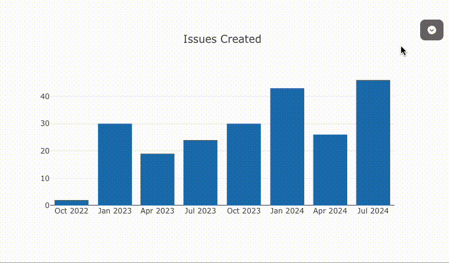
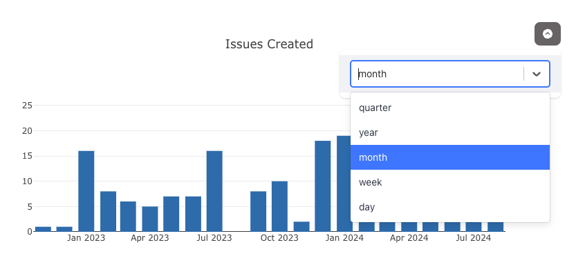
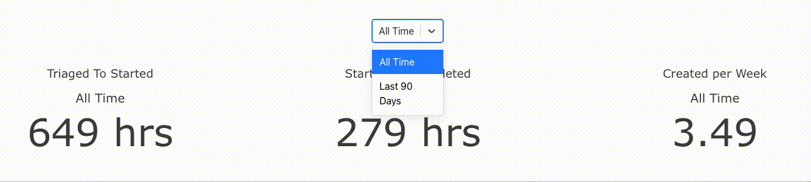

# Interactivity

At first glance you may think that Visivo's push based architecture removes the ability to create interativity elements in your dashboard. However you can **create powerful & dynamic interactivity** in your dashboards by utilizing the [selector](/../reference/configuration/Selector/). 

## Define a Selector

The [selector](/../reference/configuration/Selector/) enables you to **toggle between trace cohorts** with single select or multi-select. The benefit of this approach is that you still get deterministic builds that you can test while also being able to create drill down, granularity options, filtering ect. 

!!! tip 
    
    You can leverage jinja2 [loops](/../reference/functions/jinja/loops/) and [macros](/../reference/functions/jinja/macros/) to easily generate multiple similar trace cohorts & charts.

    For example you might want to create multiple different traces for different date grains and then add those traces to a single chart. 

    ??? example 

        ``` yaml
        
        #  
        traces:
        # 
          - name: issues-created-per-{{date_grain}}
            model: ref(issues)
            cohort_on: "'{{date_grain}}'"
            props: 
              type: bar
              x: ?{date_trunc('{{date_grain}}', created_at)::date::varchar}
              y: ?{count(*) } 
            order_by: 
              - ?{date_trunc('{{date_grain}}', created_at)::date asc}
        #   
        charts:
          - name: issues-created-total-over-time
            selector: 
              name: issue_metrics_date_grain
              type: single
            traces:
             #
             - ref(issues-created-per-{{date_grain}})
             #   
            layout: 
              title: 
                text: Issues Created
              barmode: stack 
              legend: 
                orientation: h
                valign: bottom
        
        ```
        
### Importance of `trace.cohort_on`
The `cohort_on` block of the trace enables you to dynamically split out series based into distinct groups. This is super helpful for dynamcially creating multiple lines, bars, ect with a single trace. 
??? Example 
    Say you have a trace that shows revenue per week defined like this: 
    ``` yaml
    traces: 
      - name: revenue-per-week
        model: ref(orders)
        props:
          type: scatter
          x: ?{ date_trunc('week', date) } 
          y: ?{ sum(amount) }
    ```
    This would produce a single line with the week on the x axis and the sum of order amounts on the y axis. However, let's say you want to split this out by product type sold. To do that you can add a `cohort_on` attribute. 
    ``` yaml
    traces: 
      - name: revenue-per-week
        model: ref(orders)
        cohort_on: product_name
        props:
          type: scatter
          x: ?{ date_trunc('week', date) } 
          y: ?{ sum(amount) }
    ```
These cohort values are also the primary way you can create interactivity across your charts by telling a selector, when it should show different trace cohorts. 

## Re-use the Selector 
You are able to reference [selectors](../reference/configuration/Selector/) from across your project on multiple charts By name using the `ref()` function. This enables you to connect charts to a single [selector](../reference/configuration/Selector/). 

!!! note 
    If the selector is defined _within a chart_, all of the **trace cohort** values from that chart will be used to set the options for the selector.

    However if you define the [selector](../reference/configuration/Selector/) at the top of your project you can include as many traces as you want to pull in a broader selection of **trace cohorts**


## Position the Selector in a Dashboard
You have two options for showing your selector in the dashboard. 

1. You can define your [selector](../reference/configuration/Selector/) within a single chart. If you do this, your [selector](../reference/configuration/Selector/) will be present on that charts pop down menu. This is a great option if you want to provide interactivity without adding too much noise to the main dashboard canvas.  
   

2. You can place the [selector](../reference/configuration/Selector/) in a [dashboard item](../reference/configuration/Dashboard/Row/Item/) to have it occupy a dedicated spot on the dashboard canvas. 
   