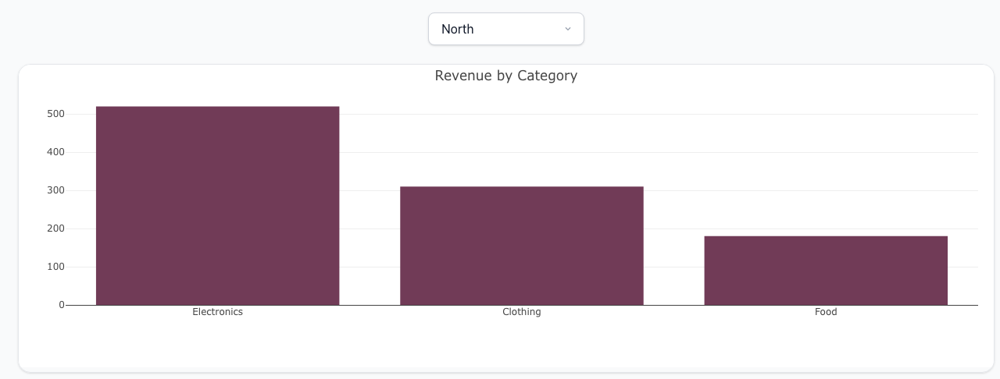
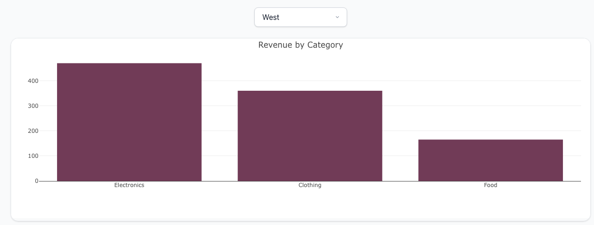

# Interactivity

Visivo's interactivity is built around [Inputs](/../reference/configuration/Inputs/SingleSelectInput/). An Input is a dashboard control — single-select dropdown, multi-select, range slider — whose value flows into your insight queries via the `${ref(input_name).value}` placeholder.



Switching the dropdown re-renders the chart against the new filter — no round-trip to the source database, no page reload:



## How it works

1. Define an Input at the top of your project (or inline in a dashboard item).
2. Reference the Input from an Insight's `props` or `interactions` using `${ref(input_name).value}` (or `.values` for multi-select).
3. The viewer re-runs the insight's `post_query` against its parquet data each time the Input changes — no round-trip to the source database.

The screenshots above are produced by this project (`test-projects/docs-interactivity/project.visivo.yml`):

```yaml
inputs:
  - name: region
    type: single-select
    options: ["North", "South", "East", "West"]
    display:
      type: dropdown
      default:
        value: North

insights:
  - name: revenue-by-region
    props:
      type: bar
      x: ?{ ${ref(sales_data).category} }
      y: ?{ ${ref(sales_data).amount} }
      marker:
        color: "#713B57"
    interactions:
      - filter: ?{ ${ref(sales_data).region} = '${ref(region).value}' }

charts:
  - name: revenue-chart
    layout:
      title:
        text: "Revenue by Category"
    insights:
      - ${ref(revenue-by-region)}

dashboards:
  - name: Sales
    rows:
      - height: compact
        items:
          - input: ${ref(region)}
      - height: medium
        items:
          - chart: ${ref(revenue-chart)}
```

## Reference

- [SingleSelectInput](/../reference/configuration/Inputs/SingleSelectInput/) — one-of-many picker
- [MultiSelectInput](/../reference/configuration/Inputs/MultiSelectInput/) — pick zero or more options, or use a numeric range slider
- [Insight interactions](/../reference/configuration/Insight/) — `filter`, `sort`, and `split` clauses that bind to inputs
