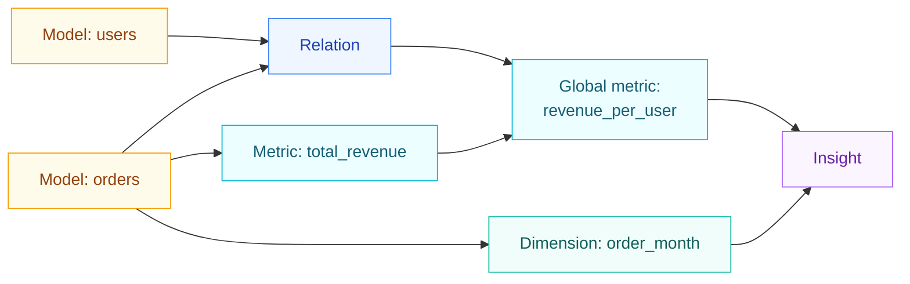

# Semantic layer

The semantic layer is where you define business logic once, as **Metrics**, **Dimensions**, and **Relations**, then reuse it across every [Insight](../concepts/insight.md). Metrics are reusable aggregates, Dimensions are reusable row-level fields, and Relations declare how Models join so Visivo can auto-generate cross-model SQL.

!!! visivo "Define once, compute everywhere"
    Without a semantic layer the same calculation gets re-written in every chart and the
    definitions drift. Defining a Metric, Dimension, or Relation once means every Insight
    computes it identically, and a single edit updates every dashboard that uses it.

<div class="grid cards" markdown>

-   :visivo-metric:{ .lg .middle .vz-metric } **Metric**

    ---

    A reusable aggregate (`SUM`, `COUNT`, a ratio). Model-scoped metrics use direct SQL
    aggregates; global metrics compose other metrics.

-   :visivo-dimension:{ .lg .middle .vz-dimension } **Dimension**

    ---

    A reusable, per-row computed field you group or filter by. Model columns also become
    implicit dimensions automatically.

-   :visivo-relation:{ .lg .middle .vz-relation } **Relation**

    ---

    A declared join condition between two Models, so Visivo generates the correct `JOIN`
    when an Insight pulls fields from both.

</div>

## Metric: a reusable aggregate

A **Metric** names an aggregate calculation so charts share one definition. Metrics come in two flavors.

### Model-scoped metrics

Defined under a Model's `metrics:` list, these use direct SQL aggregate expressions. The
`expression` must be a valid aggregate and cannot reference raw columns outside an aggregate
function.

```yaml title="project.visivo.yml"
models:
  - name: orders
    sql: SELECT * FROM orders_table
    metrics:
      - name: total_revenue
        expression: "SUM(amount)"
        description: "Total revenue from all orders"
      - name: order_count
        expression: "COUNT(DISTINCT id)"
```

### Global metrics

Defined at the project level under a top-level `metrics:` list, global metrics compose other
metrics or fields across Models using `${ref(model).field}` or `${ref(metric_name)}` syntax.
Visivo resolves the dependencies and joins automatically.

```yaml title="project.visivo.yml"
metrics:
  - name: revenue_per_user
    expression: "${ref(orders).total_revenue} / ${ref(users).total_users}"
    description: "Average revenue per user"
```

!!! note "Metric naming"
    A Metric `name` must be a valid SQL identifier (letters, numbers, and underscores only),
    and it cannot start with a number.

## Dimension: a reusable row-level field

A **Dimension** is a calculated field evaluated for each row, used in `GROUP BY` or as a
filter. Unlike a Metric, it is not aggregated. Define them under a Model's `dimensions:` list.

```yaml title="project.visivo.yml"
models:
  - name: orders
    sql: SELECT * FROM orders_table
    dimensions:
      - name: order_month
        expression: "DATE_TRUNC('month', order_date)"
        description: "Month when the order was placed"
      - name: is_high_value
        expression: "CASE WHEN amount > 1000 THEN true ELSE false END"
        data_type: BOOLEAN
```

### Implicit dimensions

You do not have to declare a Dimension for every column. Visivo automatically exposes each of
a Model's columns as an **implicit dimension**, with its `data_type` auto-detected from the
source schema. Declare an explicit Dimension only when you need a computed expression. An
Insight can reference either a declared Dimension or a raw column with the same
`${ref(model).field}` syntax.

## Relation: how two Models join

A **Relation** declares the join condition between two Models so a Metric can combine data
across them and Visivo can generate the `JOIN` automatically. The Models involved are
inferred from the `condition`, which must reference at least two different Models with
`${ref(model).field}` syntax. You cannot join on a Metric (an aggregated value).

```yaml title="project.visivo.yml"
relations:
  - name: orders_to_users
    join_type: inner
    condition: "${ref(orders).user_id} = ${ref(users).id}"
    is_default: true
```

| Field | Values | Purpose |
|-------|--------|---------|
| `join_type` | `inner`, `left`, `right`, `full` | The SQL join to use. Defaults to `inner`. |
| `condition` | `${ref(a).x} = ${ref(b).y}` | The join predicate; must reference two Models. |
| `is_default` | `true` / `false` | Disambiguates which Relation to use when multiple exist between the same pair of Models. |

!!! note "Relations join within a single source"
    Both Models in a Relation must use the same [Source](../concepts/source.md), because a SQL
    join requires all tables to be reachable from one database connection. To combine data
    from different Sources, use a
    [LocalMergeModel](../reference/configuration/Models/LocalMergeModel/index.md).

## How it fits together



## Learn more

- [Semantic layer concept](../concepts/semantic-layer.md): the short overview.
- [Insight](../concepts/insight.md): how Insights consume Metrics and Dimensions.
- Reference:
  [Metric](../reference/configuration/Metric/index.md),
  [Dimension](../reference/configuration/Dimension/index.md),
  [Relation](../reference/configuration/Relation/index.md).
