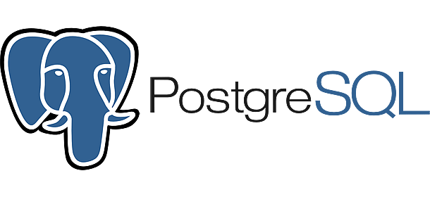
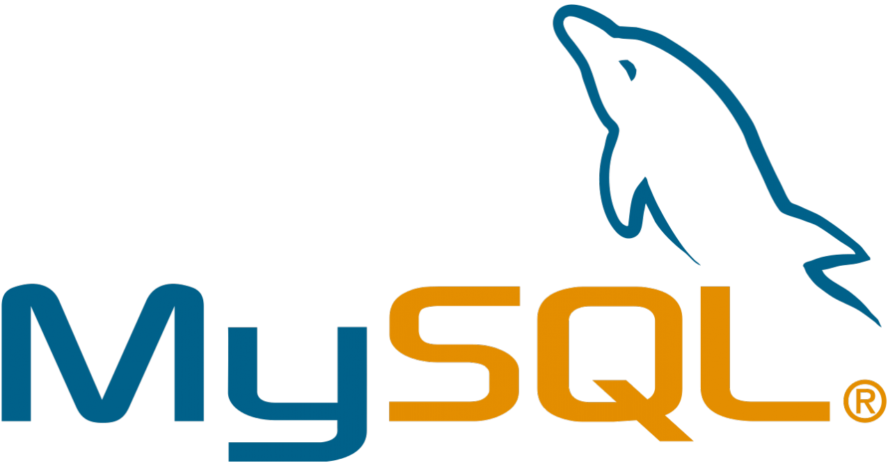

# Source Overview
Sources are connections to your data warehouses or databases. This page describes some best practices around setting up sources. 

!!! tip
    There is specific documentation on how to connect to a variety of databases in the Configuration documentation ([ie. PostgresSQL](/../reference/configuration/sources/PostgresqlSource/))

## Supported Connectors 
Sources are typically OLAP or OLTP SQL based data warehouses and databases. 

We have pre-built connectors for the most popular databases; however, you can also connect to nosql data stores, API, script and document sources and through [CsvScriptModels](/../reference/configuration/Models/CsvScriptModel/).
<div class="grid cards" markdown>

-  [:octicons-arrow-right-24: Docs](/../reference/configuration/Sources/SqliteSource/)
-  [:octicons-arrow-right-24: Docs](/../reference/configuration/Sources/PostgresqlSource/)
-  [:octicons-arrow-right-24: Docs](/../reference/configuration/Sources/SnowflakeSource/)
-  [:octicons-arrow-right-24: Docs](/../reference/configuration/Sources/MysqlSource/)
-  [:octicons-arrow-right-24: Docs](/../reference/configuration/Sources/BigQuerySource/)
-  [:octicons-arrow-right-24: Docs](/../reference/configuration/Sources/DuckdbSource/)
</div>

## One Project Many Sources
Visivo enables you to configure multiple sources in a single project. 

This is really useful for joining together data that lives in different sources. 

Once your sources are set up, you can bring data together in a single chart with traces that originate from different sources, or through sqlite queries that leverage tables from multiple sources (see [LocalMergeModel](/../reference/configuration/Models/LocalMergeModel/)), or through writing csvs to stdout (see [CsvScriptModels](/../reference/configuration/Models/CsvScriptModel/)).


## Environments 
We recommend that you think of a source as a consistent data source you have across environments.  

For example lets say you have an application that stores its data in a PostgreSQL database call `app_db` and runs locally, in staging, and in production. 

You have three separate databases, but they all used to run your application, so we'd recommend making that a single `source`. The following might be how you set up the source in your project:

``` yaml
sources:
  - name: domain_source
    database: app_db
    type: postgresql
    port: 5432
    host:  "{{ env_var('APP_HOST') }}" 
    username:  "{{ env_var('APP_DATABASE_USERNAME') }}" 
    password:  "{{ env_var('APP_DATABASE_USERNAME') }}" 
```

This structure then allows you to set your username, password, and host differently in each environment to connect with the right app_db. 

!!! tip 
    You can use the [`env_var` function](/../reference/functions/jinja/macros/#environment-variables-env_var) to store any secrets or things that you would want to change dynamically in different environments. 
