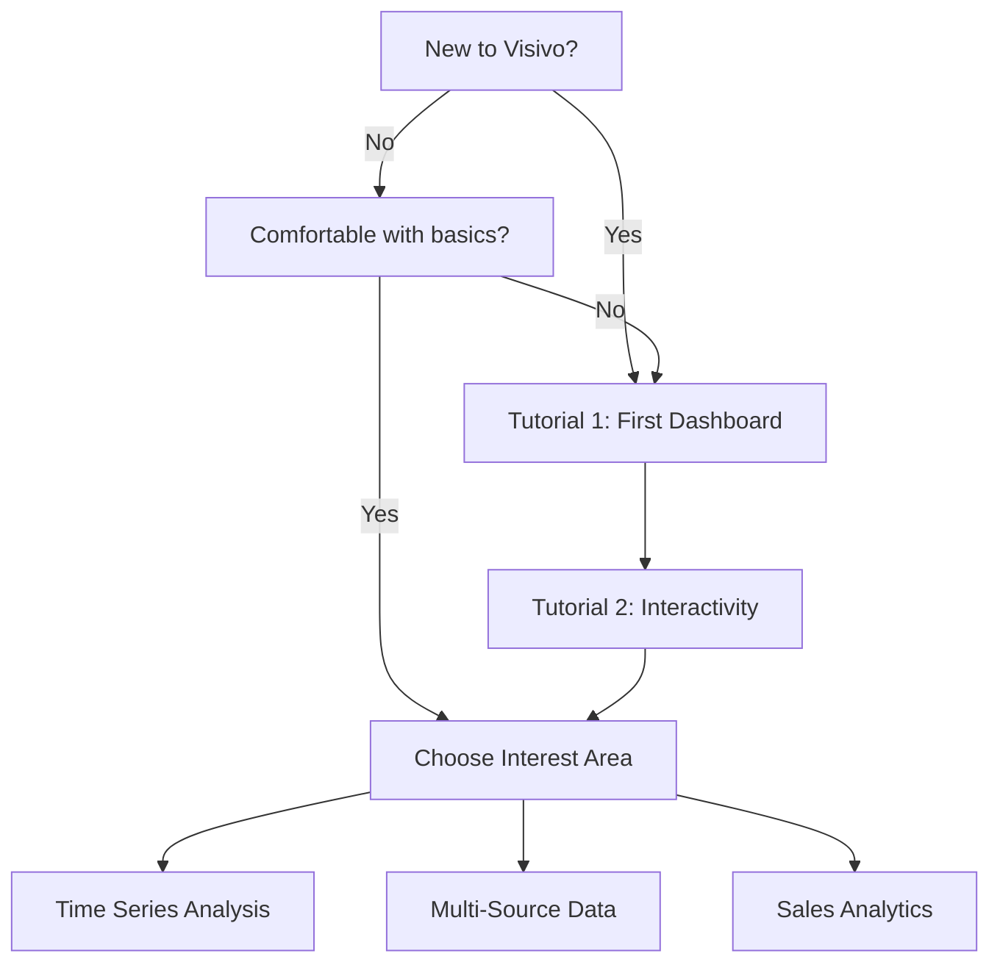

# Tutorials

Learn Visivo by building real dashboards from start to finish. Each tutorial walks you through a complete project with explanations at every step.

## Tutorial Path

<div class="grid cards" markdown>

### 🎯 Beginner Path

Start here if you're new to Visivo.

-   **[Tutorial 1: Building Your First Dashboard](first-dashboard.md)**  
    _30 minutes_
    
    Create a simple sales dashboard from scratch. Learn the basics of sources, traces, charts, and dashboards.
    
    **You'll learn:**
    - Setting up data sources
    - Creating basic charts
    - Building dashboard layouts
    - Running locally with `visivo serve`

-   **[Tutorial 2: Adding Interactivity](adding-interactivity.md)**  
    _45 minutes_
    
    Make your dashboards interactive with filters, selectors, and dynamic updates.
    
    **You'll learn:**
    - Adding date range selectors
    - Creating dropdown filters  
    - Linking charts together
    - Using selector references

### 📊 Intermediate Path

Ready for more complex visualizations.

-   **[Tutorial 3: Time Series Analysis](time-series.md)**  
    _45 minutes_
    
    Build a comprehensive time series dashboard with trends, seasonality, and forecasts.
    
    **You'll learn:**
    - Working with time-based data
    - Creating rolling averages
    - Adding trend lines
    - Comparing periods

-   **[Tutorial 4: Multi-Source Analytics](multi-source.md)**  
    _60 minutes_
    
    Combine data from multiple databases into unified dashboards.
    
    **You'll learn:**
    - Configuring multiple sources
    - Using LocalMergeModel
    - Cross-database joins
    - Source-specific optimizations

-   **[Tutorial 5: Building a Sales Dashboard](sales-dashboard.md)**  
    _90 minutes_
    
    Create a complete sales analytics dashboard with KPIs, trends, and geographic analysis.
    
    **You'll learn:**
    - Complex dashboard layouts
    - Multiple chart types
    - Calculated metrics
    - Professional styling

### 🚀 Advanced Path

Master advanced features and techniques.

-   **[Tutorial 6: Custom Visualizations](custom-viz.md)**  
    _60 minutes_
    
    Create advanced and custom visualizations using Visivo's full capabilities.
    
    **You'll learn:**
    - Advanced trace properties
    - Custom color scales
    - Complex annotations
    - JavaScript expressions

-   **[Tutorial 7: Production Deployment](production-deploy.md)**  
    _75 minutes_
    
    Deploy dashboards to production with CI/CD, testing, and monitoring.
    
    **You'll learn:**
    - Writing comprehensive tests
    - Setting up GitHub Actions
    - Managing environments
    - Monitoring dashboard performance

-   **[Tutorial 8: dbt Integration](dbt-integration.md)**  
    _90 minutes_
    
    Integrate Visivo with your dbt project for seamless analytics.
    
    **You'll learn:**
    - Connecting to dbt models
    - Using dbt tests
    - Visualization best practices
    - Documentation integration

</div>

## Learning Approach

### 🎓 How Tutorials Work

Each tutorial follows a consistent structure:

1. **Overview** - What you'll build and why
2. **Prerequisites** - What you need to know
3. **Setup** - Getting your environment ready
4. **Step-by-Step Instructions** - Detailed walkthrough
5. **Explanations** - Why we do things this way
6. **Exercises** - Practice what you learned
7. **Next Steps** - Where to go from here

### 💡 Tips for Success

- **Type the code yourself** - Don't just copy/paste
- **Experiment** - Try changing values and see what happens
- **Read the explanations** - Understanding "why" is crucial
- **Do the exercises** - They reinforce key concepts
- **Check your work** - Compare with provided solutions

### 🎯 Choose Your Path



## Tutorial Format Example

Here's what to expect in each tutorial:

```yaml
# What We're Building
A real-time sales dashboard showing:
- Revenue trends
- Product performance  
- Regional breakdown
- Customer segments

# Final Result
[Screenshot of completed dashboard]

# Time Required
45 minutes (plus exercises)

# Prerequisites
✓ Visivo installed
✓ Basic SQL knowledge
✓ Sample data downloaded
```

## Quick Reference

| Tutorial | Difficulty | Time | Key Concepts |
|----------|------------|------|--------------|
| [First Dashboard](first-dashboard.md) | Beginner | 30 min | Sources, traces, charts |
| [Adding Interactivity](adding-interactivity.md) | Beginner | 45 min | Selectors, filters |
| [Time Series](time-series.md) | Intermediate | 45 min | Time data, trends |
| [Multi-Source](multi-source.md) | Intermediate | 60 min | Multiple databases |
| [Sales Dashboard](sales-dashboard.md) | Intermediate | 90 min | Complete project |
| [Custom Viz](custom-viz.md) | Advanced | 60 min | Advanced properties |
| [Production](production-deploy.md) | Advanced | 75 min | Deployment, CI/CD |
| [dbt Integration](dbt-integration.md) | Advanced | 90 min | dbt models |

## After the Tutorials

Once you've completed the tutorials, explore:

- 📖 [How-To Guides](../howto/index.md) - Specific task instructions
- 🍳 [Cookbook](../cookbook/index.md) - Production-ready recipes  
- 📊 [Chart Gallery](../gallery/index.md) - All visualization types
- 📚 [Reference Docs](../reference/configuration/index.md) - Complete API

## Get Help

- 💬 [Community Slack](https://visivo-community.slack.com) - Ask questions
- 🐛 [GitHub Issues](https://github.com/visivo-io/visivo/issues) - Report problems
- 📧 [Email Support](mailto:support@visivo.io) - Direct assistance

---

_Ready to start learning?_ [**Begin Tutorial 1 →**](first-dashboard.md)