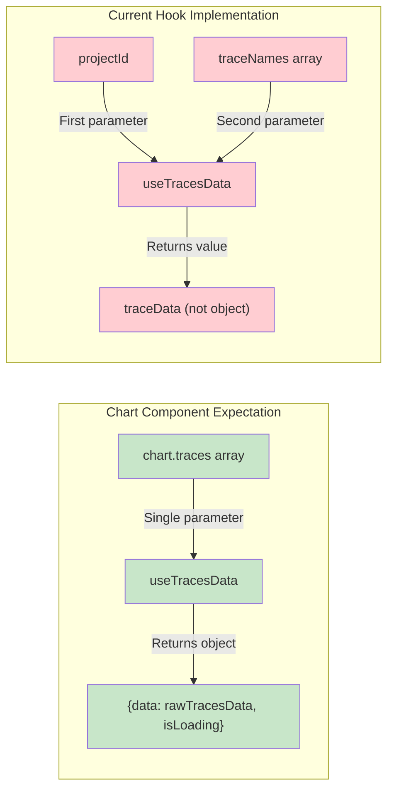
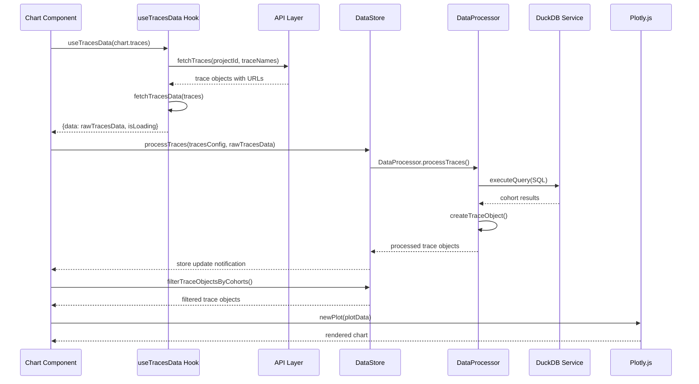
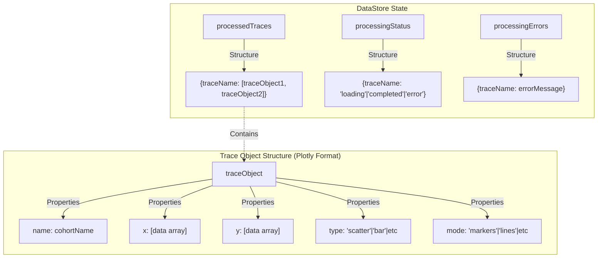

# Trace Data Flow Analysis

## Current Architecture (Phase 2 Post-Refactor)

```mermaid
graph TD
    %% User Input
    A[Chart Component] -->|chart.traces array| B[useTracesData Hook]
    
    %% Raw Data Fetching Layer
    B -->|projectId, traceNames| C[React Query useQuery]
    C -->|fetchTraces function| D[QueryContext Provider]
    D -->|useFetchTraces| E[API fetchTraces]
    
    %% API Layer
    E -->|HTTP Request| F["/api/traces" OR "/data/traces.json"]
    F -->|JSON Response| G[Trace Objects with signed_data_file_url]
    
    %% Raw Data Processing
    G -->|traces array| H[fetchTracesData Function]
    H -->|Parallel fetch calls| I[Individual trace data URLs]
    I -->|HTTP Responses| J[Raw JSON Trace Data]
    
    %% Data Processing Pipeline
    J -->|rawTracesData Object| K[Chart Component processTraces]
    K -->|tracesConfig + rawTracesData| L[DataStore processTraces]
    L -->|DataProcessor.processTraces| M[DataProcessor Class]
    
    %% DuckDB Processing
    M -->|For each trace| N[DataProcessor.processTrace]
    N -->|Raw data| O[DuckDB Service]
    O -->|SQL Query Execution| P[DuckDB WASM]
    P -->|Cohort Results| Q[DataProcessor.createTraceObject]
    
    %% Final Data Structure
    Q -->|Plotly Trace Objects| R[DataStore processedTraces]
    R -->|Store Update| S[Chart Component useStore]
    
    %% Chart Rendering
    S -->|filterTraceObjectsByCohorts| T[Filtered Trace Objects]
    T -->|plotData| U[Plotly.js Chart Render]
    
    %% Selector Integration
    S -->|getAllCohortNames| V[CohortSelect Component]
    V -->|selectedCohorts| W[Filter Logic]
    W -->|Updated Selection| T
    
    %% Styling
    classDef component fill:#e1f5fe
    classDef hook fill:#f3e5f5
    classDef service fill:#e8f5e8
    classDef store fill:#fff3e0
    classDef api fill:#fce4ec
    classDef data fill:#f1f8e9
    
    class A,V component
    class B,S hook
    class M,O service
    class L,R store
    class E,F api
    class J,T,U data
```

## Interface Mismatch Issues

### Current useTracesData Hook Problems:
1. **Parameter Mismatch**: Hook expects `(projectId, traceNames)` but Chart calls with `(chart.traces)`
2. **Return Mismatch**: Hook returns `traceData` but Chart expects `{ data, isLoading }`

### Expected vs Actual Interface:



## Data Transformation Pipeline

```mermaid
graph TD
    %% Input Data
    A[Raw Trace Configuration] -->|Array of trace objects| B[Trace Names Extraction]
    B -->|["trace1", "trace2", ...]| C[API Trace Fetch]
    
    %% Raw Data Structure
    C -->|Response| D["[{name: 'trace1', signed_data_file_url: 'url1'}, ...]"]
    D -->|fetchTracesData| E[Raw Trace Data]
    E -->|Structure| F["{trace1: {props.x: [...], props.y: [...]}...}"]
    
    %% Processing Phase
    F -->|DataProcessor.processTraces| G[Cohort Processing]
    G -->|For each trace| H[DuckDB SQL Execution]
    H -->|GROUP BY cohort_on| I[Cohorted Results]
    
    %% Final Structure
    I -->|createTraceObject| J[Plotly Trace Objects]
    J -->|Array per trace| K["{trace1: [{name: 'cohort1', x: [...], y: [...], type: 'scatter'}...]}"]
    
    %% Chart Consumption
    K -->|filterTraceObjectsByCohorts| L[Filtered Trace Objects]
    L -->|Flat array| M["[{name: 'cohort1', x: [...], y: [...]}...]"]
    M -->|plotData| N[Plotly.newPlot]
    
    classDef input fill:#e3f2fd
    classDef process fill:#f3e5f5
    classDef output fill:#e8f5e8
    
    class A,D,F input
    class G,H,I process
    class J,K,L,M,N output
```

## Component Interaction Flow



## Store State Structure



## Key Benefits of Current Architecture

1. **Clean Data Flow**: Simple pipeline from raw data to rendered charts
2. **Client-Side Processing**: DuckDB WASM provides efficient SQL processing
3. **Zustand Store**: Centralized state management for processed traces
4. **Plotly Ready**: Trace objects are in final rendering format
5. **Cohort Filtering**: Efficient filtering without re-processing
6. **Error Handling**: Granular error tracking per trace

## Issues to Address

1. **Hook Interface Mismatch**: Fix useTracesData parameter/return signature
2. **Project ID Context**: Need proper project ID resolution
3. **Loading States**: Ensure proper loading coordination between hook and store
4. **Error Propagation**: Coordinate error handling between layers